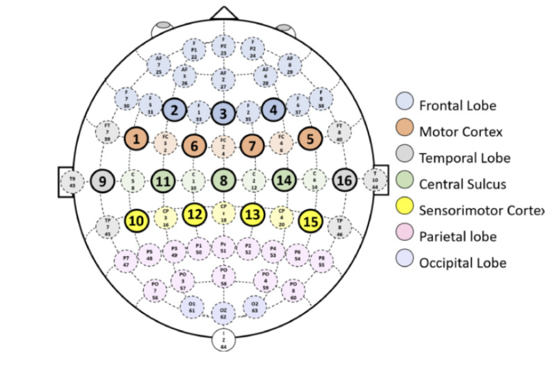
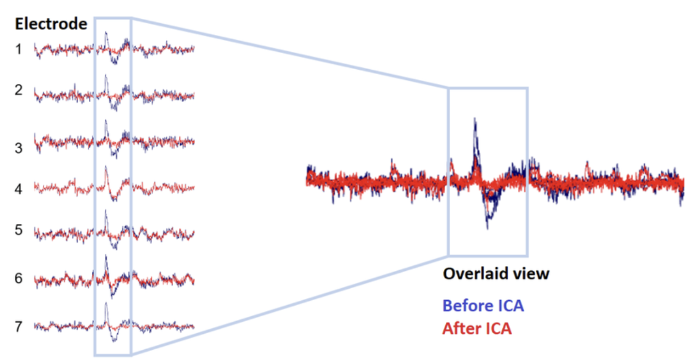

# **Actividad de Procesamiento y Análisis de Señales EEG**

## **Tabla de contenidos**
1. Preprocesamiento de señales EEG
2. Optimización de características para ML
3. Análisis integrado con MNE-Python


## 1. Origen de los datos [1]
Para el registro y análisis de las señales EEG se utilizó un equipo no invasivo Ultra Cortex Mark IV. Este dispositivo opera con una frecuencia de muestreo (fs) de 125 Hz, además presenta 16 electrodos secos (base de plata clorada). El dataset usado fue del paquete de MNE, la cual contiene una función que contiene señales EEG.


Figura 1: Las áreas de Brodmann y el sistema de colocación de electrodos 10-10

## 2. Procedimiento de preprocesamiento [2]
Especificar filtros aplicados (rangos frecuenciales, notch), método de alineación y eliminación de artefactos (ICA).
Para el preprocesamiento de las señales EEG, se utilizó un filtro pasa banda activo en un rango frecuencial de 5 a 50 Hz, Las formas de onda más comúnmente estudiadas incluyen delta (0,5 a 4 Hz); theta (4 a 7 Hz); alfa (8 a 12 Hz); sigma (12 a 16 Hz) y beta (13 a 30 Hz)[2]. Así mismo el equipo de lectura de señales EEG presenta un filtro notch a 60 Hz (para atenuar la interferencia de la línea eléctrica)[3]. Ultracortex no elimina los artefactos por parpadeos o movimientos musculares, por lo que utiliza un análisis de componentes independientes para realizar una limpieza para el análisis y clasificación de las señales EEG, se utilizan librerías MNE en python para implementar ICA para EEG, logrando así separar la actividad cerebral de artefactos oculares, musculares, 60hz del VAC[4].

```
# set up and fit the ICA
ica = mne.preprocessing.ICA(n_components=20, random_state=97, max_iter=800)
ica.fit(raw)
ica.exclude = [1, 2]  # details on how we picked these are omitted here
ica.plot_properties(raw, picks=ica.exclude)
```



Fuente: https://www.researchgate.net/figure/EEG-data-before-and-after-ICA-artefacts-removal-artefacts-potentially-coming-from-eye_fig3_364936500

## 3. Extracción de características
[Extracción de características_ipynb](https://github.com/Christianayala12/GRUPO2-ISB-2025-I/blob/master/Laboratorios/Laboratorio%2011%20-%20MNE-EEG/ML_EEG_LAB_ISB.ipynb)

## 4. Optimización y selección
[Optimización y selección_ipynb](https://github.com/Christianayala12/GRUPO2-ISB-2025-I/blob/master/Laboratorios/Laboratorio%2011%20-%20MNE-EEG/ML_EEG_LAB_ISB.ipynb)


## Referencias
[1]Víctor Asanza, et al. “MILimbEEG: A Dataset of EEG Signals Related to Upper and Lower Limb Execution of Motor and Motor Imagery Tasks.” Data in Brief, vol. 50, 7 Sept. 2023, pp. 109540–109540, pmc.ncbi.nlm.nih.gov/articles/PMC10505670/, https://doi.org/10.1016/j.dib.2023.109540.  
[2]C. S. Nayak and A. C. Anilkumar, “EEG Normal Waveforms,” Nih.gov, Jul. 24, 2023. https://www.ncbi.nlm.nih.gov/books/NBK539805/  
[3]X. Li, W. Z. Rymer, G. Li, and P. Zhou, “The effects of notch filtering on electrically evoked myoelectric signals and associated motor unit index estimates,” Journal of NeuroEngineering and Rehabilitation, vol. 8, no. 1, Nov. 2011, doi: https://doi.org/10.1186/1743-0003-8-64.  
[4]“(PDF) IAC: On the Feasibility of Utilizing Neural Signals for Access Control,” ResearchGate, 2018, doi: https://doi.org/10.1145//3274694.3274713.  
