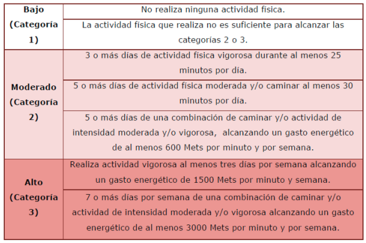

# **Proyecto: Análisis de la activación de músculos extensores y flexores del antebrazo durante tareas de mecanografía y clickeo en población de estudiantes universitarios con y sin actividad física regular.**

## **Introducción**
La digitalización ha impulsado un uso cada vez más intensivo de dispositivos electrónicos como computadoras, laptops y tablets. Actividades rutinarias como la mecanografía (proceso de introducir texto o caracteres alfanuméricos) y el uso del mouse, en especial el clic repetitivo (Los clicks por segundo (CPS) son una métrica fundamental que se utiliza para evaluar la velocidad y la agilidad de los movimientos de los dedos), se han convertido en tareas fundamentales tanto en contextos académicos como profesionales. Estas acciones implican una repetición constante de movimientos finos de los dedos y la muñeca, lo que provoca una activación sostenida de los músculos flexores y extensores del antebrazo, aumentando el riesgo de fatiga muscular y posibles trastornos musculoesqueléticos.[1][2]

El uso de computadoras y otros dispositivos se encuentra en su nivel más alto hasta la fecha y se espera que continúe aumentando a medida que la tecnología se vuelva más accesible.[3]

Se considera que los movimientos rápidos y repetitivos de los dedos al usar el teclado y/o la carga muscular estática y las posturas al usar el ratón son factores de riesgo importantes para los TME relacionados con las computadoras. El uso del mouse proporciona cierta evidencia fisiológica que puede explicar por qué el uso del mouse tiene una mayor asociación con lesiones relacionadas con la computadora.[4]

No obstante, no todas las personas expuestas a estas tareas repetitivas desarrollan síntomas con la misma intensidad. Diversos estudios sugieren que la práctica regular de actividad física podría desempeñar un rol protector frente a la fatiga y los trastornos musculoesqueléticos. Por ejemplo, se ha encontrado que el ejercicio mejora la función ejecutiva y el rendimiento motor, incluso en tareas como la mecanografía [5]. Además, después de actividad física moderada, se observa un aumento en la velocidad de tipeo sin comprometer la precisión [6]. Sin embargo, se ha reportado una preocupante disminución en los niveles de actividad física, especialmente entre jóvenes peruanos, lo cual podría incrementar su vulnerabilidad frente al uso prolongado de dispositivos electrónicos [7].

En este contexto, nuestra investigación busca comparar el desempeño en tareas de mecanografía y clickeo entre personas físicamente activas y aquellas que no realizan actividad física regular. El objetivo es identificar si existen diferencias significativas en la velocidad, precisión y signos de fatiga, lo que podría evidenciar el rol modulador de la condición física sobre los efectos del uso repetitivo de dispositivos tecnológicos. Con ello, se espera aportar evidencia que relacione el estilo de vida activo con una mejor tolerancia a las exigencias digitales cotidianas.


### **Estadísticas**
Tiempo de uso de computadoras durante el uso de recursos académicos en una biblioteca.


### **Definición de la problemática**
La fatiga muscular por uso prolongado de ordenadores ya sean portátiles o de escritorio suponen una reducción en la eficiencia del propósito de su uso. Las actividades que involucran el uso de los ordenadores son frecuentes tanto en entornos laborales como educativos, y su práctica prolongada puede inducir sobrecarga muscular, especialmente en los músculos del antebrazo, muñeca y mano.

## **Soluciones actuales**

1. Una revisión sistemática de las aplicaciones de EMG para la caracterización de la actividad muscular del antebrazo y la mano durante las actividades de la vida diaria: resultados, desafíos y cuestiones abiertas. (https://pmc.ncbi.nlm.nih.gov/articles/PMC8123433/)

2. Un estudio de la actividad muscular del antebrazo y la cinemática de la muñeca en trabajadores de oficina sintomáticos que realizan tareas de clic del mouse con diferentes exigencias de precisión y velocidad. (https://pubmed.ncbi.nlm.nih.gov/20643564/)

3. Evaluación electromiográfica de la fatiga muscular: una profundización en la actividad de mecanografía repetitiva. (https://www.sciencedirect.com/science/article/abs/pii/S1050641104000422)

4. Examen basado en el nivel de habilidad de la activación de los músculos del antebrazo asociado con movimientos eficientes de la muñeca y los dedos al escribir. (https://www.sciencedirect.com/science/article/pii/S016981412300063X)

5. Impacto de los clics repetitivos del mouse en la fatiga muscular del antebrazo y el rendimiento de la puntería del mouse. (https://www.sciencedirect.com/science/article/pii/S0003687024000619)

## **Propuesta de solución**
Se plantea la realización de un estudio de electromiografía para evaluar y comparar la activación muscular de los músculos extensores y flexores del antebrazo durante tareas de mecanografía y clickeo en estudiantes universitarios activos físicamente y sedentarios.

## **Metodología**
### **Participantes**
El estudio contará con la participación de un total de 6 estudiantes matriculados en el curso "Introducción a las Señales Biomédicas" de la Universidad Peruana Cayetano Heredia (UPCH), con edades entre los 20-24 años. Los participantes serán clasificados según el nivel de actividad física utilizando el Cuestionario Internacional de Actividad Física (IPAQ). A partir de los resultados del cuestionario, serán agrupados en dos categorías: Activos físicamente (Categoría 3), quienes cumplen completamente con las recomendaciones de actividad física y sedentarios (Categoría 1), quienes no cumplen con las recomendaciones mínimas. Cada grupo tendrá una muestra de 3 participantes. 
Los participantes deberán firmar un consentimiento informado antes de participar en el estudio.

#### **Criterios de Exclusión**
Estudiantes con lesiones musculoesqueléticas en la zona del antebrazo actuales o pasadas que puedan interferir con la activación muscular del antebrazo.

#### **Cuestionario validado para clasificar a los participantes según su nivel de actividad física**

Cuestionario Internacional de actividad física (IPAQ): (https://dialnet.unirioja.es/descarga/articulo/5920688.pdf)

Evalúa el nivel de actividad física de adultos entre 18 y 65 años en los últimos 7 días. Se utiliza para categorizar la actividad física en niveles (bajo, moderado o alto). Cuenta con dos versiones, la versión corta de 7 preguntas y la versión larga de 27 preguntas.

- Versión corta: Evalúa la frecuencia, duración e intensidad de la actividad física intensa, moderada, caminata y tiempo sentado. Es la versión más sencilla y recomendada para investigaciones.
  - Aspectos clave:
    - Frecuencia: Días por semana de cada actividad
    - Duración: Tiempo por día de cada actividad
  
  - El tiempo se mide en Mets (Unidades de Índice Metabólico), con valores de referencia:
    - Caminar: 3.3 Mets.
    - Actividad moderada: 4 Mets.
    - Actividad vigorosa: 8 Mets.
    - n° Mets. = Actividad * días * minutos 


  - Niveles de actividad física:
    - Bajo: No cumple con las recomendaciones de actividad física.
    - Moderado: Cumple parcialmente
    - Alto: Cumple completamente con las recomendaciones



### **Actividades a realizar**

- Mecanografía:
  - 15 min de mecanografía en una de las siguientes aplicaciones: https://agilefingers.com/es/test
  https://www.keybr.com/es/ 
  - Se medirá la actividad muscular en los 2 primeros y finales minutos de la realización de la mecanografía

- Clicks:
  - Se realizarán 2 actividades posibles durante 5 minutos cada uno y 2 minutos de descanso:
    - Primera actividad: Clickear el mouse para diferentes objetivos (Flappy Bird, Dinosaur Game o Piano Tiles)
    - Segunda actividad:  Clickear lo más rápido posible (https://orteil.dashnet.org/cookieclicker/) 
    - Tercera actividad: Clickear por tiempos.

  - Se medirá la actividad muscular en los 2 primeros y finales minutos de las actividades.


### **Protocolo de Adquisición de Señales**
#### **Materiales**
Para hacer las mediciones, se utilizarán 2 Bitalinos por persona.


### **Procesamiento de Señales**
#### **Código**

```
import os
import numpy as np
import h5py
import torch
import torch.nn as nn
import torch.optim as optim
import matplotlib.pyplot as plt
from torch.utils.data import Dataset, DataLoader, random_split
from scipy.signal import butter, filtfilt
from sklearn.metrics import classification_report, accuracy_score, f1_score

# === GPU o CPU ===
device = torch.device("cuda" if torch.cuda.is_available() else "cpu")
print(f"Usando dispositivo: {device}")

# === CONFIGURACIÓN ===
FS = 1000  # Hz
VENTANA = 1000  # 1 segundo
RUTAS = {
    "FLEXOR": r"C:\Users\Christian\Documents\SEÑALES\FLEXOR",
    "EXTENSOR": r"C:\Users\Christian\Documents\SEÑALES\EXTENSOR"
}

# === FILTRADO DE SEÑAL EMG ===
def filtrar_emg(senal, fs=1000, low=20, high=450):
    b, a = butter(4, [low / (fs / 2), high / (fs / 2)], btype='band')
    return filtfilt(b, a, senal)

# === DATASET PERSONALIZADO ===
class EMGDataset(Dataset):
    def __init__(self, rutas, ventana=1000):
        self.samples = []

        for musculo, ruta in rutas.items():
            for sujeto in os.listdir(ruta):
                path_sujeto = os.path.join(ruta, sujeto)
                if not os.path.isdir(path_sujeto): continue

                for archivo in os.listdir(path_sujeto):
                    if archivo.endswith(".h5") and ("princ" in archivo or "inicio" in archivo or "final" in archivo):
                        etiqueta = 1 if "final" in archivo else 0
                        ruta_archivo = os.path.join(path_sujeto, archivo)
                        try:
                            with h5py.File(ruta_archivo, 'r') as f:
                                root = list(f.keys())[0]
                                senal = np.array(f[root + "/raw/channel_1"]).flatten()
                                senal = filtrar_emg(senal)

                                # Ventaneo
                                num_ventanas = len(senal) // ventana
                                for i in range(num_ventanas):
                                    segmento = senal[i*ventana:(i+1)*ventana]
                                    self.samples.append((segmento.astype(np.float32), etiqueta))
                        except Exception as e:
                            print(f"Error en {archivo}: {e}")

    def __len__(self):
        return len(self.samples)

    def __getitem__(self, idx):
        x, y = self.samples[idx]
        return torch.tensor(x).unsqueeze(0), torch.tensor(y, dtype=torch.long)

# === MODELO CNN 1D ===
class CNN1D(nn.Module):
    def __init__(self):
        super().__init__()
        self.conv1 = nn.Conv1d(1, 16, kernel_size=5, padding=2)
        self.bn1 = nn.BatchNorm1d(16)
        self.pool = nn.MaxPool1d(2)
        self.conv2 = nn.Conv1d(16, 32, kernel_size=5, padding=2)
        self.bn2 = nn.BatchNorm1d(32)
        self.fc1 = nn.Linear(32 * (VENTANA // 4), 64)
        self.fc2 = nn.Linear(64, 2)

    def forward(self, x):
        x = self.pool(torch.relu(self.bn1(self.conv1(x))))
        x = self.pool(torch.relu(self.bn2(self.conv2(x))))
        x = x.view(x.size(0), -1)
        x = torch.relu(self.fc1(x))
        return self.fc2(x)

# === ENTRENAMIENTO DEL MODELO ===
def entrenar_modelo(modelo, train_loader, val_loader, epochs=60):
    criterio = nn.CrossEntropyLoss()
    optimizador = optim.Adam(modelo.parameters(), lr=1e-3)

    loss_hist, acc_hist, f1_hist = [], [], []

    for epoch in range(epochs):
        modelo.train()
        losses = []
        for xb, yb in train_loader:
            xb, yb = xb.to(device), yb.to(device)
            optimizador.zero_grad()
            salida = modelo(xb)
            loss = criterio(salida, yb)
            loss.backward()
            optimizador.step()
            losses.append(loss.item())

        # === Validación ===
        modelo.eval()
        y_true, y_pred = [], []
        with torch.no_grad():
            for xb, yb in val_loader:
                xb, yb = xb.to(device), yb.to(device)
                out = modelo(xb)
                pred = out.argmax(dim=1)
                y_true.extend(yb.cpu().tolist())
                y_pred.extend(pred.cpu().tolist())

        acc = accuracy_score(y_true, y_pred)
        f1 = f1_score(y_true, y_pred)
        loss_mean = np.mean(losses)

        loss_hist.append(loss_mean)
        acc_hist.append(acc)
        f1_hist.append(f1)

        print(f"Epoch {epoch+1} - Loss: {loss_mean:.4f} - Val Acc: {acc:.3f} - Val F1: {f1:.3f}")

    print("\n=== Última evaluación ===")
    print(classification_report(y_true, y_pred))
    return loss_hist, acc_hist, f1_hist

# === CARGA Y DIVISIÓN DEL DATASET ===
dataset = EMGDataset(RUTAS, ventana=VENTANA)
train_size = int(0.8 * len(dataset))
val_size = len(dataset) - train_size
train_ds, val_ds = random_split(dataset, [train_size, val_size])

train_loader = DataLoader(train_ds, batch_size=32, shuffle=True)
val_loader = DataLoader(val_ds, batch_size=32)

# === INSTANCIAR Y ENTRENAR MODELO EN GPU ===
cnn = CNN1D().to(device)
losses, accs, f1s = entrenar_modelo(cnn, train_loader, val_loader, epochs=60)

# === GRAFICAR RESULTADOS ===
plt.figure(figsize=(10,4))
plt.subplot(1, 2, 1)
plt.plot(losses, label="Loss")
plt.title("Loss por época")
plt.xlabel("Época")
plt.ylabel("Loss")
plt.grid()
plt.legend()

plt.subplot(1, 2, 2)
plt.plot(accs, label="Accuracy")
plt.plot(f1s, label="F1-score")
plt.title("Val Accuracy y F1")
plt.xlabel("Época")
plt.ylabel("Score")
plt.grid()
plt.legend()

plt.tight_layout()
plt.show()

# === GUARDAR MODELO (opcional) ===
# torch.save(cnn.state_dict(), "modelo_cnn_emg.pt")

```

```
from sklearn.metrics import confusion_matrix, ConfusionMatrixDisplay

def evaluar_matriz_confusion(modelo, val_loader):
    modelo.eval()
    y_true, y_pred = [], []

    with torch.no_grad():
        for xb, yb in val_loader:
            xb, yb = xb.to(device), yb.to(device)
            out = modelo(xb)
            pred = out.argmax(dim=1)
            y_true.extend(yb.cpu().tolist())
            y_pred.extend(pred.cpu().tolist())

    # Crear y mostrar matriz
    cm = confusion_matrix(y_true, y_pred)
    disp = ConfusionMatrixDisplay(confusion_matrix=cm, display_labels=["No fatiga", "Fatiga"])
    disp.plot(cmap="Blues")
    plt.title("Matriz de Confusión - CNN EMG")
    plt.grid(False)
    plt.show()

# 🔹 Llamar la función
evaluar_matriz_confusion(cnn, val_loader)
```

## **Referencias**

1. https://dapencentroestudios.com/importancia-mecanografia-por-ordenador/
2. https://elperiodicodeyecla.com/clicks-por-segundo-test-compruebe-que-tan-rapido-puede-hacer-clic/
3. http://scielo.senescyt.gob.ec/scielo.php?script=sci_arttext&pid=S2631-27862021000400023
4. https://pmc.ncbi.nlm.nih.gov/articles/PMC9798874/
5. https://www.biomedcentral.com/epdf/10.1186/1479-5868-8-98?sharing_token=m-57djXtO-MBCbJsHtDPcm_BpE1tBhCbnbw3BuzI2RN2QVl0o6IRGvx-oRNffeIDF9CYdA88GuExeEL3euE4kNTxLnpLM1Tsv3W8D_RJ5-OJffm9pQhd4O1zr_JuhgZcBO7pNcPzV8t2w2mdP50lOw%3D%3D 
6. https://pubmed.ncbi.nlm.nih.gov/39405599/ 
7. https://pubmed.ncbi.nlm.nih.gov/29791529/ 

