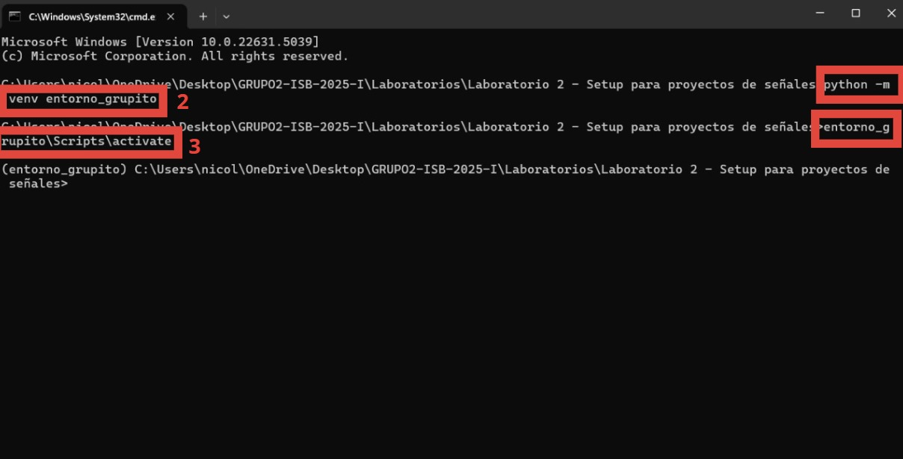

# Laboratorio 2
## Instalar Python en su ultima version (Windows)
Para instalar Python en su version 3.13.2 hacer [click aqui](https://www.python.org/ftp/python/3.13.2/python-3.13.2-amd64.exe)
Para los casos en los que se tenia una version antigua, verificar en terminal con:
```
python --version
```
Si no esta actualizado debera seguir los siguientes pasos:
1. Seleccionar  **Inicio**
2. Seleccionar  **Configuracion**
3. En el buscador escribir  **Propiedades del sistema** y seleccionar  **Configuración avanzada del sistema**
4. Seleccionar  **Variables de entorno**
5. En  **Variables del sistema** seleccionar **Path**
6. Luego seleccionar Nuevo y escribir la ruta del directorio en el que se encuentra Python313 y borrar las otras versiones
7. Seleccionar **aceptar**


## Instalar Python en su ultima version (MacOS)
Para instalar Python en su version 3.13.2 hacer [click aqui](https://www.python.org/ftp/python/3.13.2/python-3.13.2-amd64.exe)
Para los casos en los que se tenia una version antigua, verificar en terminal con:
```
python --version
```
En la terminal verificar si esta instalado la ultima version de python:
```
which python
```
Deberia imprimir lo siguiente:
```
/Library/Frameworks/Python.framework/Versions/3.13/bin/python3.13
```
De ser asi en la terminal copiar el siguiente codigo:
```
nano ~/.zshrc
```
Luego escribir el siguiente codigo:
```
exit()
```
Finalmente copiar el siguiente codigo en terminal y deberia salir la version actualizada de python:
```
nano ~/.zshrc
source ~/.zshrc
python3 —version
```

## Creación del entorno virtual
Un entorno virtual es útil porque permite el aislamiento de proyectos, asegurando que cada uno tenga sus **propias dependencias** sin interferir con otros. Además, mantiene limpio el sistema **evitando conflictos** con paquetes instalados globalmente.

### Pasos para la creación desde del cmd
1. **Abrir el CMD** en la ruta donde deseas crear el entorno virtual, en nuestro caso dentro de *Laboratorio 2*.  
2. **Crear el entorno virtual** con el comando:
```
python -m venv mi_entorno
```
3. **Activar el entorno virtual** con:
```
Nombre\Scripts\activate
```
4. **Ver las librerías instaladas** con:
```
python -m pip list
```
5. **Instalar nuevas librerías** con:
```
pip install nombre_librería
```
6.  Para el ejercicio de laboratorio, **instalar la librería NeuroKit2**:
```
pip install neurokit2
```

