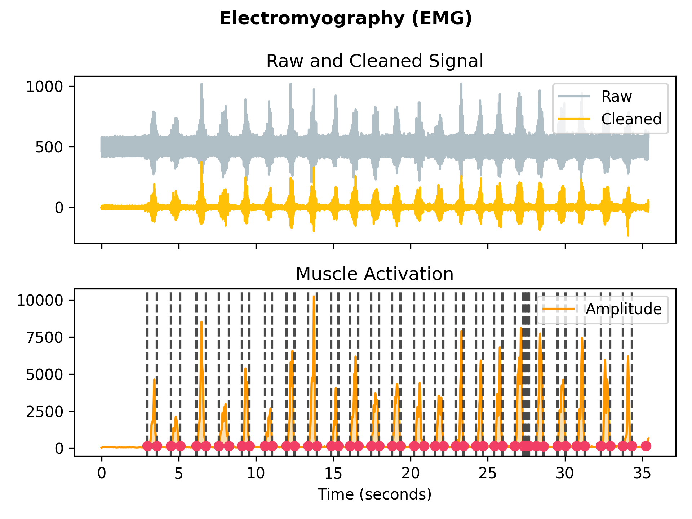
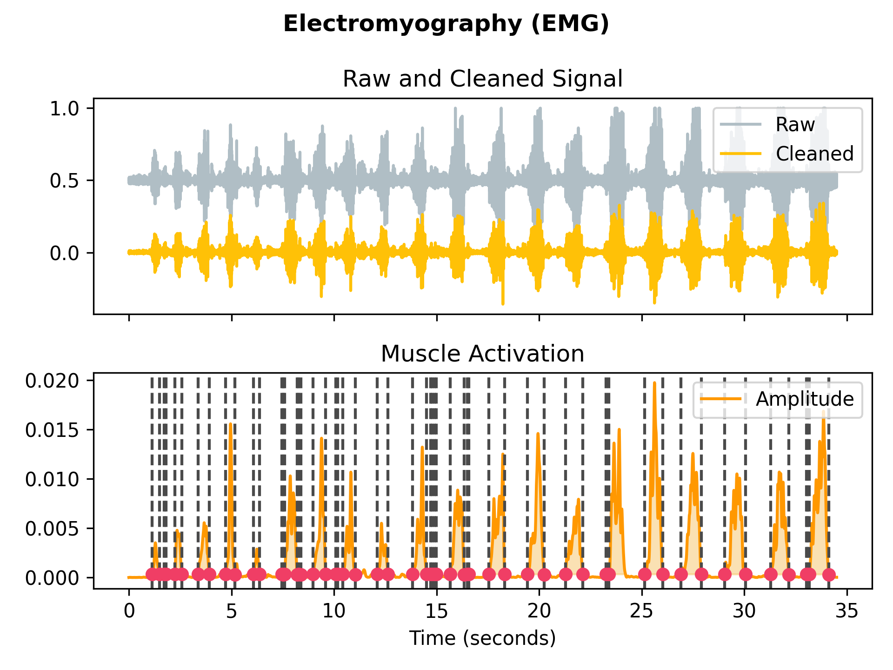

# **LABORATORIO 03: – Adquisición de señal EMG con BITalino**
## **Tabla de contenidos**

1. [Introducción](#n1)
2. [Propósito de la práctica](#n2)  
3. [Materiales y metodología](#n3)  
4. [Resultados y limitaciones](#n4)  
5. [Referencias bibliográficas](#n5)
   
 ## 1. Introducción: 
El análisis de señales biomédicas como la electromiografía (EMG) y el electrocardiograma (ECG) es esencial para evaluar el funcionamiento del sistema neuromuscular y del sistema cardiovascular, respectivamente. La EMG permite registrar la actividad eléctrica generada por los músculos, facilitando el estudio de desórdenes neuromusculares, la caracterización de la fatiga muscular y el desarrollo de interfaces de control en rehabilitación. Por su parte, el ECG proporciona información clave sobre la actividad eléctrica del corazón, siendo indispensable para la detección de arritmias, cardiopatías isquémicas y otras alteraciones cardíacas (1).  
El uso de tecnologías accesibles y didácticas como BITalino ha revolucionado la enseñanza y la investigación en bioinstrumentación. BITalino es una plataforma modular, de bajo costo y fácil integración, diseñada para la adquisición en tiempo real de señales fisiológicas. Este sistema incluye sensores para EMG, ECG, EDA, acelerometría, entre otros, y es ampliamente utilizado en entornos educativos y de investigación aplicada (2). Su compatibilidad con el software OpenSignals (r)evolution permite visualizar, procesar y exportar señales de manera sencilla, lo cual lo convierte en una herramienta ideal para prácticas académicas y prototipado de dispositivos biomédicos (3).

 ## 2. Propósito de la práctica: 
Durante la presente práctica, se empleará BITalino en conjunto con el software OpenSignals (r)evolution para la captura y visualización de señales EMG y ECG. Se abordará desde la configuración inicial del sistema hasta la exportación de datos adquiridos, permitiendo a los estudiantes familiarizarse con el flujo completo de trabajo en bioinstrumentación. Esta experiencia permitirá comprender mejor las características eléctricas de las señales musculares y cardíacas, así como adquirir habilidades prácticas en el manejo de herramientas tecnológicas en el campo de la ingeniería biomédica.

 ## 3. Materiales y metodología: 

 ### Materiales
 | Descripción                                   | Cantidad | Imagen                          |
|----------------------------------------------|----------|---------------------------------|
| Batería 3.7V                                  | 2        |  |
| OpenSignals - PLUX Wireless Biosignals SA    | 2        |  |
| Electrodos descartables tipo disco           | 6        |  |
| Cable de 3 electrodos sensor Ag/AgCl         | 2        |  |
| BITalino                                     | 2        |  |
| Laptop                                       | 2        |  |

 ### Métodos

 #### **Conexiones al Bitalino**

 
 1. Se conecta la batería de 3.7V al puerto de energía y se enciende el bluetooth de la laptop/celular.
 2. Se conecta al bitalino de código 78-31 y se desactivan todos los canales del vitalino menos el canal 1.
 3. Se conecta el sensor AG/AgCl de 3 electrodos al puerto indicado para EMG (Electromiograma)

 #### **Colocación de electrodos**
 Se evaluaron 4 músculos en el estudio de señales. 

 **Sujeto 1**
  1. Músculo fusiforme del antebrazo  
        
     Se colocan los electrodos positivo y negativo a lo largo del centro de la fibra muscular y el electrodo de referencia en el hueso del codo. Se tomaron medidas en reposo, durante ejercicios de extensión y flexión de la muñeca (4).

 **Sujeto 2**
  1. Trapecio Superior  
       

     Se colocan los electrodos positivo y negativo a lo largo del centro superior de la fibra muscular y el electrodo de referencia en la apófisis mastoides (detrás de la oreja) (5).
     
  2.  Bíceps brachii
    
         

      Se colocan los electrodos positivo y negativo a lo largo del centro del músculo y el electrodo de referencia en el hueso del codo (6). 
   

   

 

 

 ## 4. Resultados y limitaciones: 

   ### Sujeto 1
   #### Músculo fusiforme del antebrazo
   
   |                | Toma 1                  | Toma 2                  | Toma 3                  |
|----------------|------------------------------|------------------------------|------------------------------|
| Reposo         |     |         |         |
| Apretar pelota    |    |    |    |
| Pulsos hacia arriba|    |    |    |
| Pulsos hacia abajo|    |    |    |

   ### Sujeto 2
   #### Biceps Branchii

   |                | Toma 1                  | Toma 2                  | Toma 3                  |
|----------------|------------------------------|------------------------------|------------------------------|
| Reposo         |     |         |         |
| Contracción    |    |    |    |
| Con resistencia|    |    |    |

   En la primera imagen, se observa una señal EMG con amplitud relativamente constante y baja (entre los 500 uV) sin picos aparentes. Esto es debido a que existe una ausencia de actividad muscular, o en otras palabras, el músculo no está haciendo ningún esfuerzo y se encuentra en reposo.

   En la segunda imagen, hubo una activación muscular de flexión del codo, pero que empezó progresivamente, por lo que en los primeros segundos la amplitud es mínima, hasta que aparecen los primeros picos. Se puede observar que hay picos de mayor intensidad que otros, por lo que se puede decir que la fuerza del músculo no fue continua.

   La tercera imagen corresponde a una activación muscular contra resistencia. En esta imagen se observa que los picos son mucho mayores que las dos imágenes anteriores (llegando a 12500 de amplitud a comparación de 2500 de la segunda imagen). Además, la señal se mantiene con una amplitud elevada de manera más constante durante un periodo mayor de tiempo. Este comportamiento podría explicarse por la necesidad de aplicar una fuerza mucho mayor para vencer a la resistencia externa aplicada, lo que implica una mayor activación de unidades motoras.

   Finalmente, en cuanto a las limitaciones, durante la ejecución del movimiento de flexión del codo, el antebrazo entró en contacto con los electrodos colocados sobre el músculo del bíceps, lo que pudo haber generado ruido. Además, el ejercicio no fue realizado en una superficie plana ya que el electrodo neutro estaba ubicado en el codo, lo que provocó que los movimientos se realizaran técnicamente en el aire y con poca estabilidad.

   #### Trapecio

   |                | Toma 1                  | Toma 2                  | Toma 3                  |
|----------------|------------------------------|------------------------------|------------------------------|
| Reposo         |     |         |         |
| Rotación de hombros    |    |    |    |
| Con resistencia|    |    |    |

   Como se puede observar en las imágenes, en la primera no hubo cambios significativos en el voltaje. Esto se debe a que, al estar en reposo, no hay actividad de las unidades motoras, por lo que no se generan potenciales de acción que desencadenen la contracción muscular. Aunque se aprecia una ligera amplitud, esta puede atribuirse a pequeños esfuerzos involuntarios o al ruido generado por la impedancia entre el electrodo y la piel.
   
   En cambio, en las imágenes 2 y 3 se observan picos de voltaje considerablemente más altos, lo cual indica la presencia de potenciales generados por la activación de unidades motoras durante los movimientos realizados. Además, se puede notar cierta coherencia en los picos, reflejando que el esfuerzo durante los movimientos no fue constante. Las caídas de amplitud observadas corresponden a los periodos de relajación que se realizaron de forma intermitente.
   
   Además, resulta interesante comparar los picos máximos entre los dos movimientos activos. En el tercer caso, al existir una fuerza opuesta contra la cual ejercer presión, el músculo pudo generar una mayor fuerza, lo que se traduce en picos de mayor amplitud. En contraste, en el primer movimiento activo (elevación de hombros sin resistencia), el esfuerzo alcanzó un límite determinado únicamente por el rango de movimiento, lo que explica los picos de menor amplitud en esa condición.

   Finalmente, en la parte de limitaciones respecto a este músculo queremos mencionar tanto la falta de tiempo para realziar 3 registros por movimiento, la falta de electrodos en general, por lo que tuvimos que reutilizar el que se uso para el biceps, generando un gasto del electrodo como tal que podría terminar afectando en su impedancia respecto a la señal y recalcar como el sujeto 1 no tuvo un correcto guardado de datos, dejando la señal en un estado para filtrar, por lo que se pudo haber perdido data que de otra manera hubiera sido más eficaz. Además, nos hubiera gustado realizar otro movimiento opuesto, debido a que es preocupante la cercanía entre la fuerza opuesta y los electrodos
   

 ## 5. Referencias bibliográficas: 
 [1] Gisbert JA. Electromiografía clínica. 2ª ed. Madrid: Editorial Médica Panamericana; 2006.  
 [2] Tercedor Sánchez LG. Electrocardiografía clínica: fundamentos y aplicaciones. Madrid: Díaz de Santos; 2018  
 [3] Silva H, Lourenço P, Fred A. OpenSignals: A Modular Software Tool for Biomedical Signal Acquisition and Processing. In: 2014 IEEE International Symposium on Medical Measurements and Applications (MeMeA); 2014 May 30-31; Lisbon, Portugal.  
 [4] Rojas-Martínez M, García M, Alonso JF, Marín J, Mañanas MÁ. Evaluación de la función neuromuscular del antebrazo durante contracciones isométricas mediante electromiografía de superficie multicanal. Rev Iberoam Autom Inform Ind. 2011;8(2):35-44. https://doi.org/10.1016/s1697-7912(11)70024-3  
 [5] Instituto Nacional de Ciencias Neurológicas. Guía técnica de procedimientos médicos: electromiografía (EMG). Pruebas electrodiagnósticas: neuroconducción motora y sensitiva, electromiografía de aguja, latencias tardías, reflejo de parpadeo y estimulación repetitiva. Lima: Ministerio de Salud del Perú; 2016. p. 26–7.  
 [6] Burhan N, Kasno M, Ghazali R, Said MR, Abdullah SS, Jali MH. Analysis of the biceps brachii muscle by varying the arm movement level and load resistance band. J Healthc Eng. 2017;2017:1–8. https://doi.org/10.1155/2017/1631384

