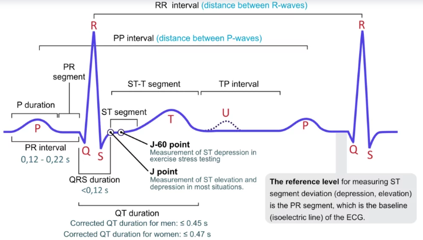
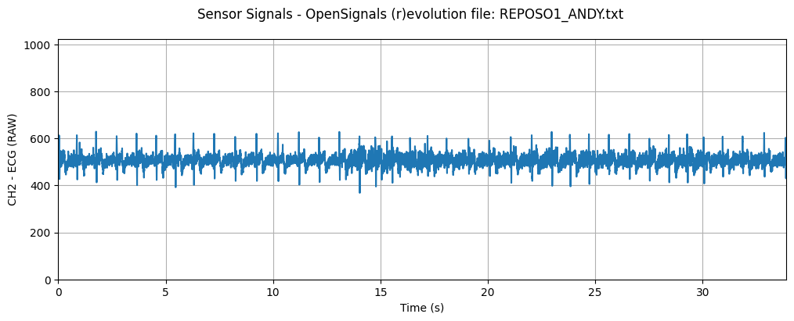
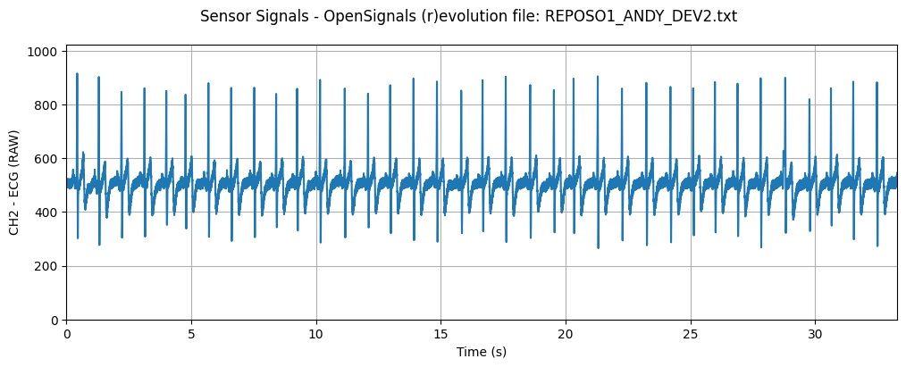
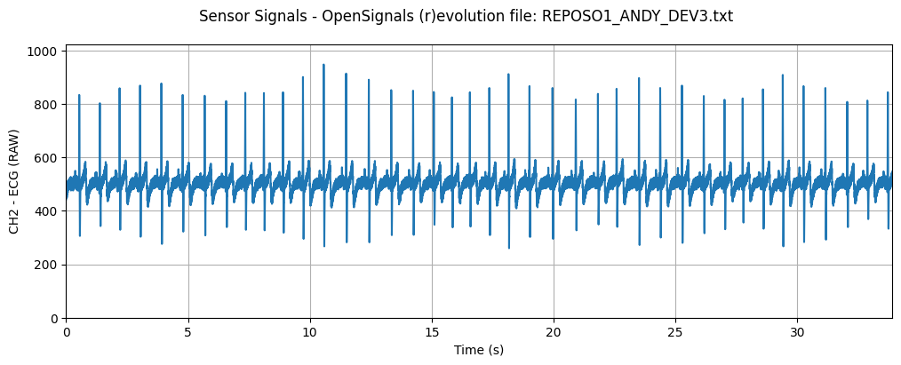
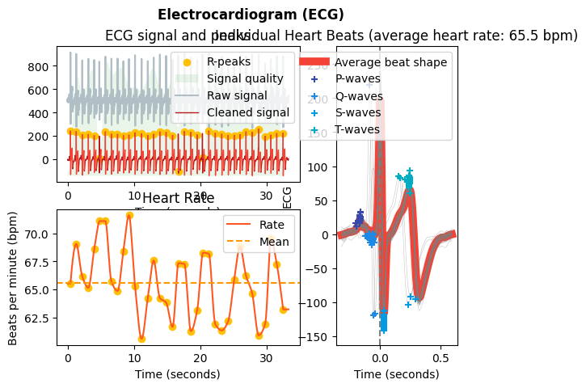
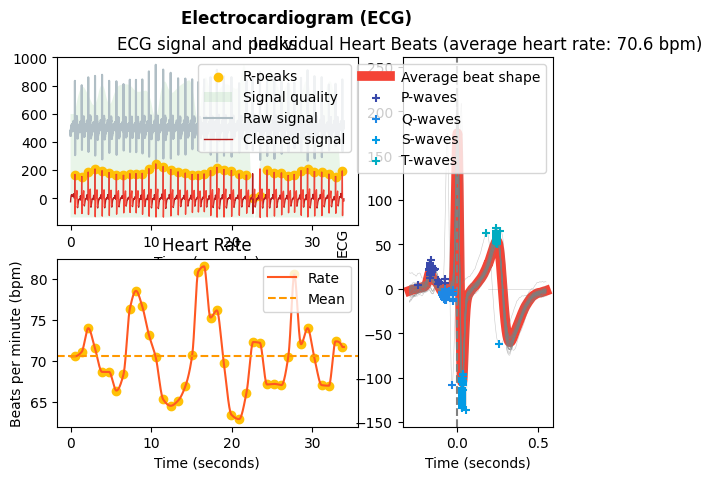
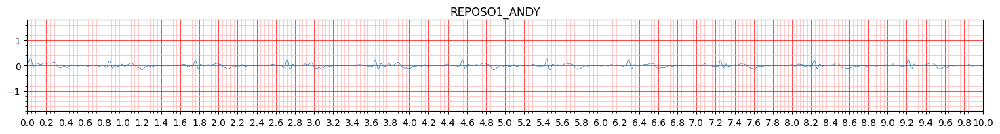
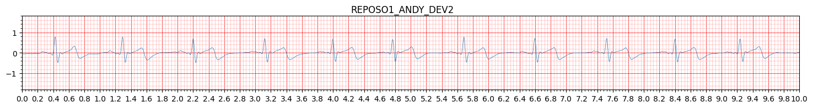
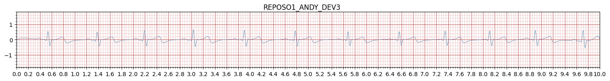

# **LABORATORIO 05: Adquisición de señal EKG con BITalino**
## **Tabla de contenidos**

1. [Introducción](#n1)
2. [Propósito de la práctica](#n2)  
3. [Materiales y metodología](#n3)  
4. [Resultados y limitaciones](#n4)\
   4.1. [Lectura de Línea Basal en Reposo](#p1)\
   4.2. [Respiración Controlada con Reposo](#p2)\
   4.3. [Lectura Post-Agotamiento Físico](#p3)\
   4.4. [Lectura Post-Apnea Prolongada](#p4)\
   4.5. [Limitaciones](#p5)
6. [Referencias bibliográficas](#n5)
   
 ## 1. Introducción 

 ### **¿Qué es un electrocardiograma (ECG)?**
El electrocardiograma o electrocardiografía es una prueba donde se ve el seguimiento eléctrico del corazón de manera no invasiva, indolora y simple. Esté concepto funciona gracias a los principios anatómicos del corazón (1), que cuenta con una células marcapasos en su nódulo SA y AV que marcan el ritmo cardíaco (en general usamos el más rápido, que en una persona sin problemas cardiacos es el SA). A partir de este contexto, el ploteo que se termina viendo en el electrocardiograma consta de unas ondas particulares ya reconocidas que nos dan datos de cómo está trabajando el corazón en general.

### **Ondas del electrocardiograma**
- **Onda P:** Es la primera onda que visualizamos y tiene una duración entre 0.12 a 0.22 segundos (incluyendo un pequeño segmento antes de la siguiente onda) (2). Está onda representa la despolarización de la aurícula y  la primera mitad representa la despolarización de la aurícula derecha mientras que la segunda mitad representa la despolarización de la aurícula izquierda (1).
- **Complejo QRS**: Luego suele seguir el arreglo QRS, que es la combinación de 3 ondas respectivas y suelen durar entre 60 a 100 milisegundos. Esté arreglo representa la despolarización ventricular, midiendo no sólo los impulsos de los ventrículos sino que también el del tabique interventricular (1).
- **Onda T**: Se visualiza al final y representa la repolarización ventricular y está suele mostrar muchas variaciones si es que se tiene presenta alguna patología (1).

  
  
<strong>Figura 1:</strong> Ondas del Electrocardiograma (2).

Cabe mencionar que estas ondas y su forma dependen mucho del modo de conexión de los electrodos (las derivaciones), por lo que esas variaciones nos dan la posibilidad de entender el funcionamiento del corazón de mejor manera. Además, cada onda nos puede dar datos a través de su forma, pero también es importante ver la amplitud de cada una y su duración, pues estos datos también son útiles para futuros diagnósticos.  
Por último, mencionar que las **enfermedades** que podemos diagnosticar con el ECG son (3):
- Arritmias
- Cardiomiopatía
- Enfermedad de las arterias coronarias
- Ataque cardiacos
- Insuficiencia cardiaca
- Enfermedad de las válvulas del corazón
- Defectos cardíacos congénitos

 ## 2. Propósito de la práctica 
 - Adquirir señales biomédicas de ECG.
 - Hacer una correcta configuración de BiTalino.
 - Extraer la información de las señales ECG del software OpenSignals (r)evolution.
 - Plotear de las señales en el dominio del tiempo en Python y analizarlas.

 ## 3. Materiales y metodología 
 ### Materiales
| Descripción                                   | Cantidad | 
|----------------------------------------------|----------|
| Batería 3.7V                                  | 1        | 
| OpenSignals - PLUX Wireless Biosignals SA    | 1        | 
| Electrodos descartables tipo disco           | 3        | 
| Cable de 3 electrodos sensor Ag/AgCl         | 1        | 
| BITalino                                     | 1        | 
| Laptop                                       | 1        | 
 
 ### Metodología

 ## 4. Resultados y limitaciones 
 Se mostrarán 3 imágenes por actividad, donde se visualizan las derivadas I, II, III en ese orden  para luego hacer un breve análisis de cada una.

 ### 4.1. Lectura de Línea Basal en Reposo 
  | Derivada | Señal cruda |
|:--------:|:------:|
| **I** |  |
| **II** |  |
| **III** |  |

| Derivada | Señal procesada |
|:--------:|:------:|
| **I** |  |
| **II** |  |
| **III** |  |

| Derivada | Señal ploteada con `ecg_plot()` |
|:--------:|:------:|
| **I** |  |
| **II** |  |
| **III** |  |

 ### 4.2. Respiración Controlada con Reposo 
 Texto

 ### 4.3. Lectura Post-Agotamiento Físico 
 Texto
 
 ### 4.4. Lectura Post-Apnea Prolongada 
 Texto
 
 ### 4.5. Limitaciones 
 Texto
 
 ## 5. Referencias bibliográficas 
 [1] Sattar, Yasar, and Lovely Chhabra. “Electrocardiogram.” Nih.gov, StatPearls Publishing, 5 June 2023, www.ncbi.nlm.nih.gov/books/NBK549803/. Accessed 28 Apr. 2025.  
 [2] Dr Araz Rawshani, M.D, PhD. “ECG Interpretation: Characteristics of the Normal ECG (P-Wave, QRS Complex, ST Segment, T-Wave).” The Cardiovascular, 30 May 2017, ecgwaves.com/topic/ecg-normal-p-wave-qrs-complex-st-segment-t-wave-j-point/. Accessed 28 Apr. 2025.  
 [3] “Electrocardiogram (ECG or EKG) - Mayo Clinic.” Mayoclinic.org, 2025, www.mayoclinic.org/es/tests-procedures/ekg/about/pac-20384983. Accessed 28 Apr. 2025.  
 [4]
 [5]
 [6]
 
