# **LABORATORIO 05: Adquisición de señal EKG con BITalino**
## **Tabla de contenidos**

1. [Introducción](#n1)
2. [Propósito de la práctica](#n2)  
3. [Materiales y metodología](#n3)  
4. [Resultados y limitaciones](#n4)\
   4.1. [Lectura de Línea Basal en Reposo](#p1)\
   4.2. [Respiración Controlada con Reposo](#p2)\
   4.3. [Lectura Post-Agotamiento Físico](#p3)\
   4.4. [Lectura Post-Apnea Prolongada](#p4)\
   4.5. [Limitaciones](#p5)
6. [Referencias bibliográficas](#n5)
   
 ## 1. Introducción 

 ### **¿Qué es un electrocardiograma (ECG)?**
El electrocardiograma o electrocardiografía es una prueba donde se ve el seguimiento eléctrico del corazón de manera no invasiva, indolora y simple. Esté concepto funciona gracias a los principios anatómicos del corazón, que cuenta con una células marcapasos en su nódulo SA y AV que marcan el ritmo cardíaco (en general usamos el más rápido, que en una persona sin problemas cardiacos es el SA) (1). A partir de este contexto, el ploteo que se termina viendo en el electrocardiograma consta de unas ondas particulares ya reconocidas que nos dan datos de cómo está trabajando el corazón en general.

### **Ondas del electrocardiograma**
- **Onda P:** Es la primera onda que visualizamos y tiene una duración entre 0.12 a 0.22 segundos (incluyendo un pequeño segmento antes de la siguiente onda) (2). Está onda representa la despolarización de la aurícula y  la primera mitad representa la despolarización de la aurícula derecha mientras que la segunda mitad representa la despolarización de la aurícula izquierda (1).
- **Complejo QRS**: Luego suele seguir el arreglo QRS, que es la combinación de 3 ondas respectivas y suelen durar entre 60 a 100 milisegundos. Esté arreglo representa la despolarización ventricular, midiendo no sólo los impulsos de los ventrículos sino que también el del tabique interventricular (1).
- **Onda T**: Se visualiza al final y representa la repolarización ventricular y está suele mostrar muchas variaciones si es que se tiene presenta alguna patología (1).

  
  
<strong>Figura 1:</strong> Ondas del Electrocardiograma (3).

Cabe mencionar que estas ondas y su forma dependen mucho del modo de conexión de los electrodos (las derivaciones), por lo que esas variaciones nos dan la posibilidad de entender el funcionamiento del corazón de mejor manera. Además, cada onda nos puede dar datos a través de su forma, pero también es importante ver la amplitud de cada una y su duración, pues estos datos también son útiles para futuros diagnósticos.  
Por último, mencionar que las **enfermedades** que podemos diagnosticar con el ECG son (3):
- Arritmias
- Cardiomiopatía
- Enfermedad de las arterias coronarias
- Ataque cardiacos
- Insuficiencia cardiaca
- Enfermedad de las válvulas del corazón
- Defectos cardíacos congénitos

 ## 2. Propósito de la práctica 
 - Adquirir señales biomédicas de ECG.
 - Hacer una correcta configuración de BiTalino.
 - Extraer la información de las señales ECG del software OpenSignals (r)evolution.
 - Plotear de las señales en el dominio del tiempo en Python y analizarlas.

 ## 3. Materiales y metodología 
 ### Materiales
| Descripción                                   | Cantidad | 
|----------------------------------------------|----------|
| Batería 3.7V                                  | 1        | 
| OpenSignals - PLUX Wireless Biosignals SA    | 1        | 
| Electrodos descartables tipo disco           | 3        | 
| Cable de 3 electrodos sensor Ag/AgCl         | 1        | 
| BITalino                                     | 1        | 
| Laptop                                       | 1        | 
 
 ### Metodología
1. Instalación del software OpenSignals
   Descargar Open Signals desde la web oficial de BITalino.
   - Pagina web: https://support.pluxbiosignals.com/knowledge-base/introducing-opensignals-revolution/
     
   - Extraer e instalar el programa.
   - Aceptar los términos y condiciones al primer inicio.
   - Activar Bluetooth en la laptop o PC.

2. Conexión de BITalino
   - Reunir el kit del BITalino: Cable de fuente de alimentación, electrodos de 3 derivaciones, batería 3.7 V, sensor electrodo desechable, guía rápida y placa BITalino.
     IMAGENNNNNNNNNN
   - Descargar el Datasheet y User Manual.
   - Consultar sección 2.2.1 para conectar correctamente el cable de ECG.
   - Colocar los electrodos en el cuerpo y conectar el BITalino a la batería.
   - Emparejar BITalino en Windows mediante Bluetooth (PIN: 1234).

3. Captura de señal ECG
   - Con OpenSignals ya configurado, visualizar la señal ECG.
   - Ubicar electrodos según el estándar de derivaciones para ECG (ondas P, QRS, T).
   - Analizar la señal en diferentes condiciones:

      - Estado basal (reposo).
         - El usuario debe permanecer sentado durante las mediciones
         IMAGENNNNNNNNNN
           Imagen 3: Imagen referencial de posición para la medición en reposo

         - Apnea (mantener respiración, precaución con la hiperventilación).
            - Se realiza la medición durante el reposo post-apnea.
              
         - Post-ejercicio (5 minutos de actividad aeróbica).
            - Se realizaron burpees y polichinelas:
            1. Burpees 1:30 minutos
            2. Polichinelas 2 minutos
            3. Burpees 30 segundos

 ## 4. Resultados y limitaciones 
 Se mostrarán 3 imágenes por actividad, donde se visualizan las derivadas I, II, III en ese orden  para luego hacer un breve análisis de cada una.

 ### 4.1. Lectura de Línea Basal en Reposo 
  | Derivada | Señal cruda |
|:--------:|:------:|
| **I** |  |
| **II** |  |
| **III** |  |

| Derivada | Señal procesada |
|:--------:|:------:|
| **I** |  |
| **II** |  |
| **III** |  |

| Derivada | Señal ploteada con `ecg_plot()` |
|:--------:|:------:|
| **I** |  |
| **II** |  |
| **III** |  |

Podemos observar que la frecuencia cardíaca promedio varía entre 65.5 y 70.6 bpm, valores que se encuentran dentro del rango normal para una persona en reposo (60 - 100 bpm (4)). Además, se aprecia una forma clara y definida de las ondas, sin variaciones visibles en los puntos de ploteo.

 ### 4.2. Respiración Controlada con Reposo 
   | Derivada | Señal cruda |
|:--------:|:------:|
| **I** | 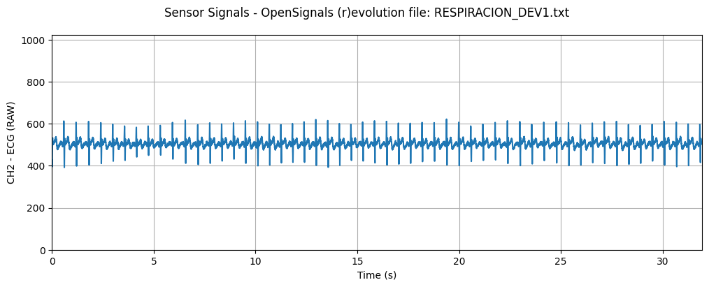 |
| **II** | 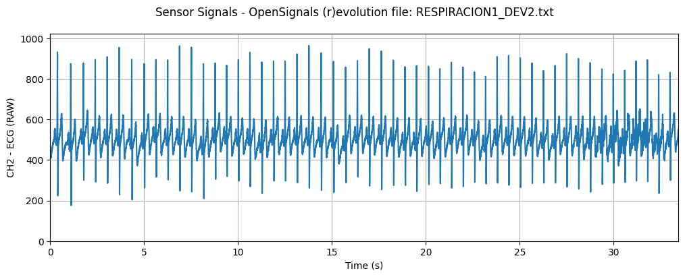 |
| **III** | 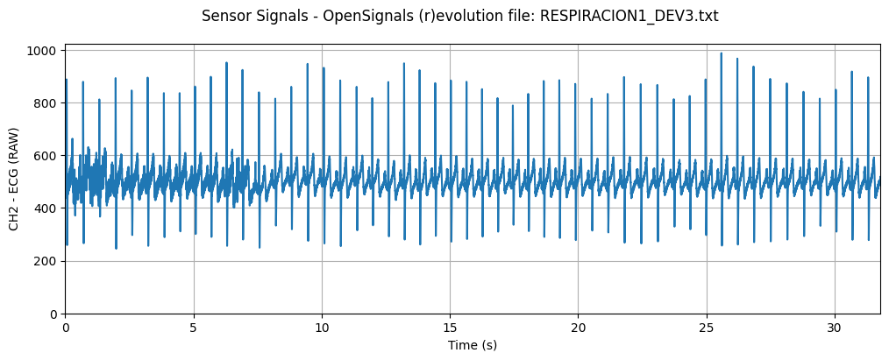 |

| Derivada | Señal procesada |
|:--------:|:------:|
| **I** | 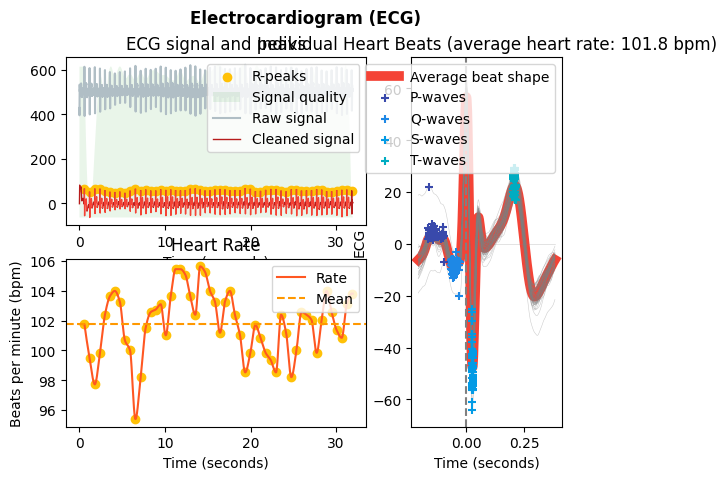 |
| **II** | 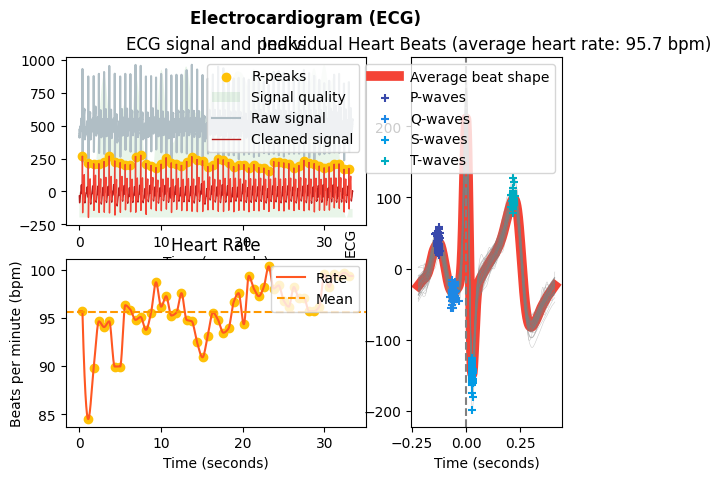 |
| **III** | 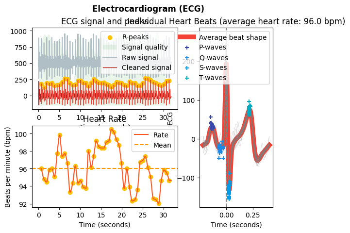 |

| Derivada | Señal ploteada con `ecg_plot()` |
|:--------:|:------:|
| **I** | 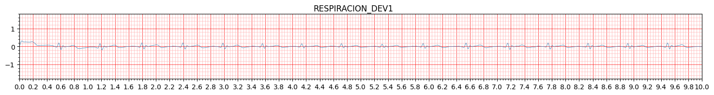 |
| **II** | 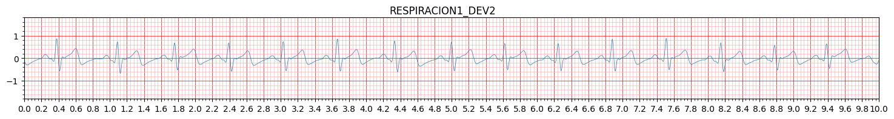 |
| **III** | 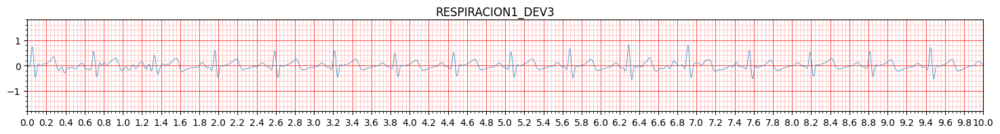 |

El promedio de la frecuencia cardíaca varió entre 66.9 y 67.8 bpm, manteniéndose dentro del rango normal. Sin embargo, se habría esperado una mayor variabilidad en la frecuencia cardíaca como tal (5). Lo que sí se puede apreciar es un cambio en la frecuencia cardíaca cada 10 segundos, lo cual es coherente con los ciclos de inhalación y exhalación del sujeto de prueba, reflejando un adecuado funcionamiento del sistema nervioso autónomo (5).

 ### 4.3. Lectura Post-Agotamiento Físico 
   | Derivada | Señal cruda |
|:--------:|:------:|
| **I** | 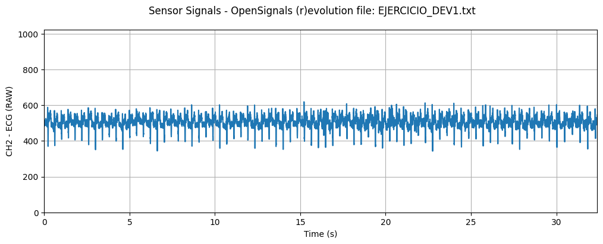 |
| **II** | 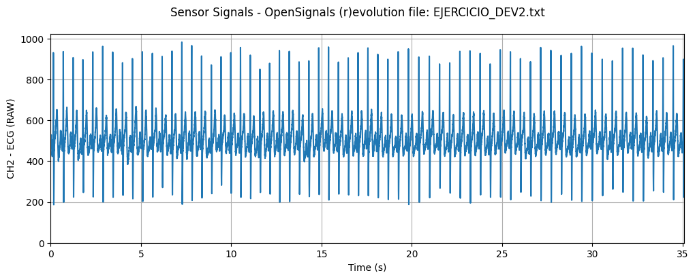 |
| **III** | 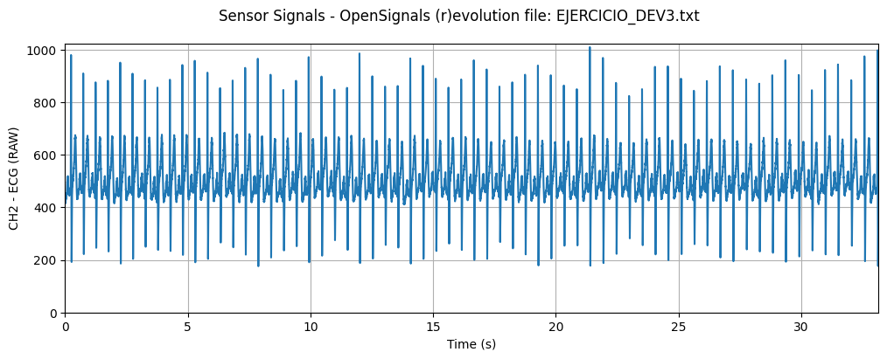 |

| Derivada | Señal procesada |
|:--------:|:------:|
| **I** | 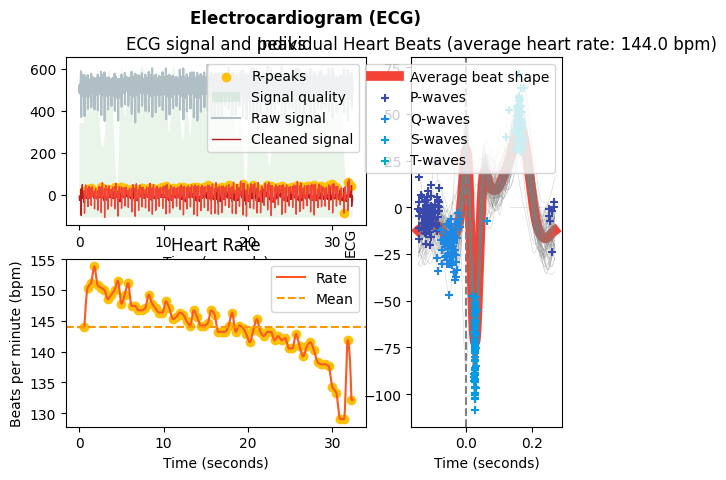 |
| **II** | 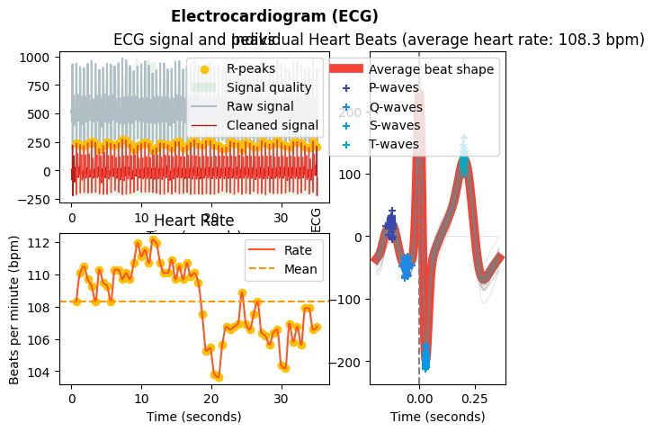 |
| **III** | 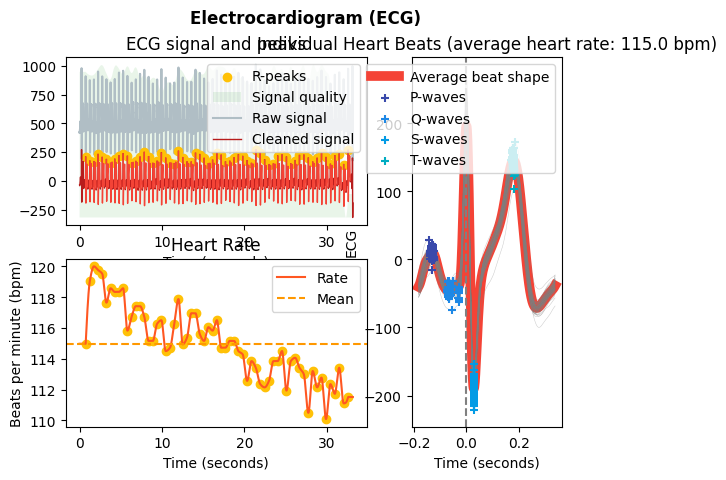 |

| Derivada | Señal ploteada con `ecg_plot()` |
|:--------:|:------:|
| **I** | 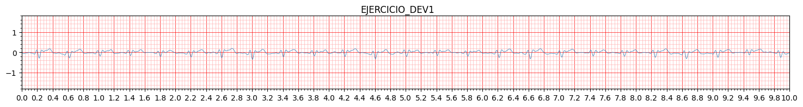 |
| **II** | 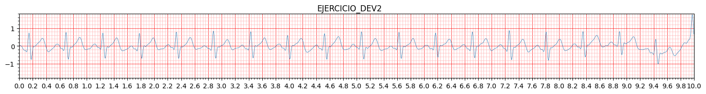 |
| **III** | 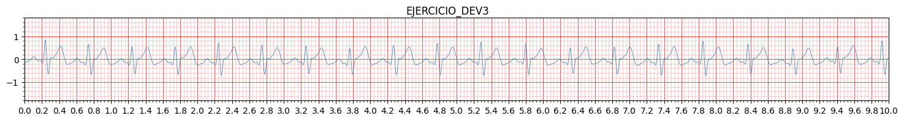 |

Durante el ejercicio, la frecuencia cardíaca del sujeto varió entre 108.3 y 104 bpm, mostrando claramente cómo se adapta con el paso del tiempo y disminuye progresivamente. Además, se observa una variación en las formas de las ondas P y T, lo que indica un aumento en la amplitud durante la despolarización auricular y la repolarización ventricular, un fenómeno esperado (6).
 
 ### 4.4. Lectura Post-Apnea Prolongada 
  | Derivada | Señal cruda |
|:--------:|:------:|
| **I** | 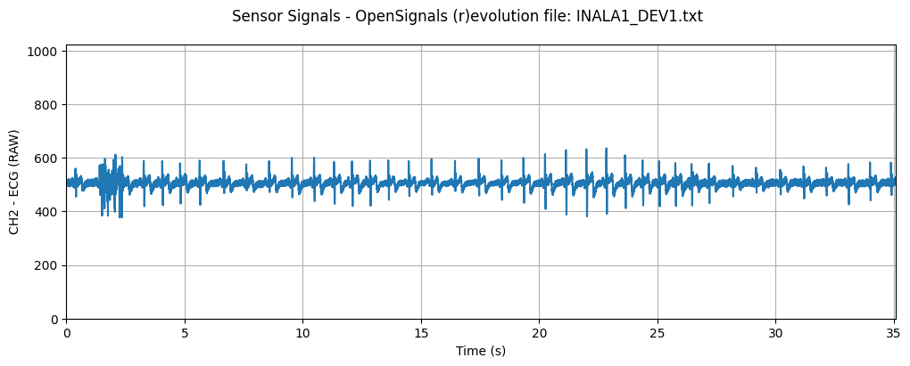 |
| **II** | 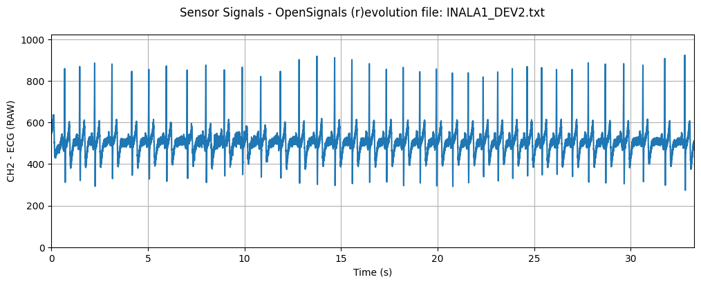 |
| **III** | 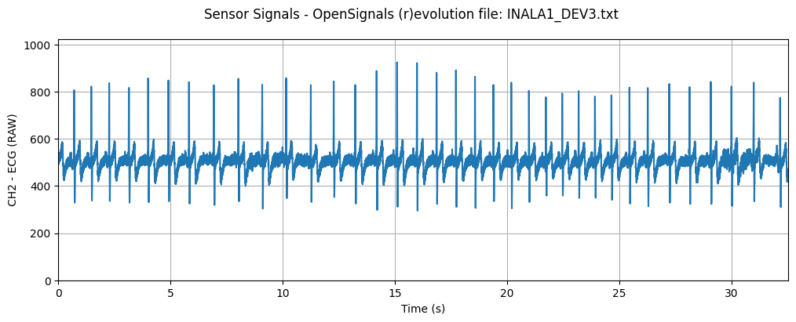 |

| Derivada | Señal procesada |
|:--------:|:------:|
| **I** | 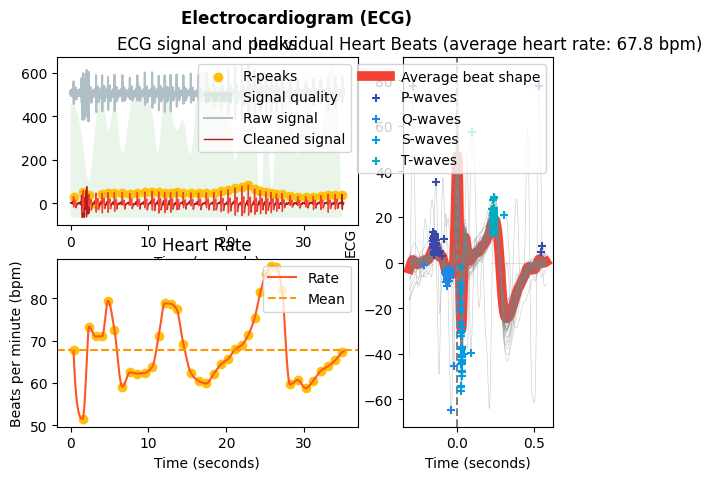 |
| **II** | 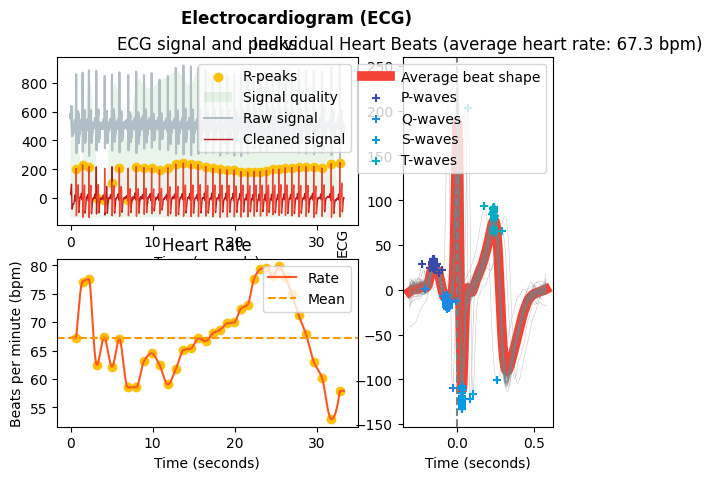 |
| **III** | 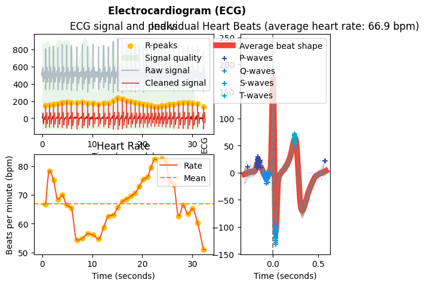 |

| Derivada | Señal ploteada con `ecg_plot()` |
|:--------:|:------:|
| **I** | 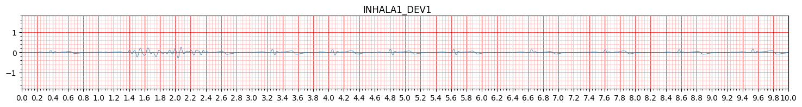 |
| **II** |  |
| **III** |  |

En este ejercicio, se observa que la frecuencia cardíaca varía entre 96 y 101 bpm, lo cual es normal considerando que el sujeto acaba de pasar por un episodio de apnea leve. En casos de apnea, es común que se genere taquicardia post-apnea, caracterizada por un aumento notable de la frecuencia cardíaca inmediatamente después del episodio de apnea. Sin embargo, no se pudo analizar de manera precisa la transición entre el aguante de la respiración y la respiración normal, ya que la grabación se realizó cuando el paciente ya había comenzado a respirar, y no en el momento previo.
 
 ### 4.5. Limitaciones 
 #### **Interferencias con el Bitalino**
 - Intentamos realizar la prueba con el sujeto y el Bitalino inmóviles, pero los pequeños movimientos naturales del paciente afectaron la precisión del Bitalino, especialmente en relación con la sensibilidad de la batería, ya que en algunos momentos se perdía la conexión con la laptop.
 - Los electrodos estuvieron en contacto con el polo y aunque seguimos la guía de colocación de los electrodos (basada en lo aprendido en clase y en las instrucciones del Bitalino), es posible que no haya sido perfecta, lo que dejó márgenes de error en los resultados. A pesar de ello, nos aseguramos de que los electrodos no tocaran la clavícula.
 #### **Condiciones del sujeto durante el reposo**
- Durante la fase de reposo e inhalación, el sujeto de pruebas mostró mucho sueño por lo que sus resultados pueden haber sido afectados por ello, teniendolo en consideración en caso la frecuencia cardiaca sea más baja que las otras gráficas.
 #### **Problemas durante la tercera muestra**
- En la tercera muestra, una alarma de incendio en el laboratorio interrumpió la prueba cuando estábamos capturando los datos de la primera derivación posterior al ejercicio. Debido a esta interrupción, la segunda y tercera derivación se realizaron después de un tiempo largo de reposo y luego de que el sujeto haya vuelto a realizar el mismo circuito de ejercicio, lo que podría haber afectado los resultados.
- Aunque el sujeto es un joven deportista, no podemos afirmar con certeza que su cuerpo se haya adaptado al estrés repentino, lo que podría influir en la precisión de la segunda y tercera derivación, especialmente en caso de anomalías. 
- Debido a un problema en el guardado de los datos, realizamos primero la derivación III y luego la derivación II. Esto se refleja en cómo el cuerpo se adaptó con el tiempo, lo que llevó a una reducción progresiva en la frecuencia cardíaca promedio, siendo menor en la tercera derivada que en la segunda.
 
 
 ## 5. Referencias bibliográficas 
 [1] Sattar, Yasar, and Lovely Chhabra. “Electrocardiogram.” Nih.gov, StatPearls Publishing, 5 June 2023, www.ncbi.nlm.nih.gov/books/NBK549803/.  
 [2] Dr Araz Rawshani, M.D, PhD. “ECG Interpretation: Characteristics of the Normal ECG (P-Wave, QRS Complex, ST Segment, T-Wave).” The Cardiovascular, 30 May 2017, ecgwaves.com/topic/ecg-normal-p-wave-qrs-complex-st-segment-t-wave-j-point/.  
 [3] “Electrocardiograma.” Medlineplus.gov, 2022, medlineplus.gov/spanish/pruebas-de-laboratorio/electrocardiograma/#:~:text=Un%20electrocardiograma%20suele%20ser%20la,card%C3%ADaco%20llamado%20prueba%20de%20esfuerzo.
 [4] “Dos Maneras Fáciles Y Precisas de Medir Tu Frecuencia Cardíaca.” Mayo Clinic, 2025, www.mayoclinic.org/es/healthy-lifestyle/fitness/expert-answers/heart-rate/faq-20057979.  
 [5] Perry, Sean, et al. “Control of Heart Rate through Guided High-Rate Breathing.” Scientific Reports, vol. 9, no. 1, 7 Feb. 2019, www.nature.com/articles/s41598-018-38058-5, https://doi.org/10.1038/s41598-018-38058-5.  
 [6] Simoons, M L, and P G Hugenholtz. “Gradual Changes of ECG Waveform during and after Exercise in Normal Subjects.” Circulation, vol. 52, no. 4, Oct. 1975, pp. 570–577, pubmed.ncbi.nlm.nih.gov/1157270/, https://doi.org/10.1161/01.cir.52.4.570. 
 
