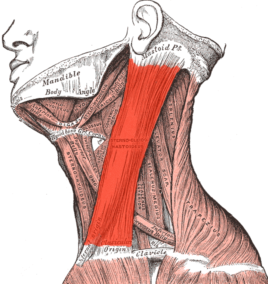

# **LABORATORIO 06: Adquisición de señal EEG con BITalino**
## **Tabla de contenidos**

1. [Introducción](#n1)
2. [Propósito de la práctica](#n2)  
3. [Materiales y metodología](#n3)  
4. [Resultados y limitaciones](#n4)
5. [Referencias bibliográficas](#n5)

 ## 1. Introducción 
El EEG es la prueba realizada para la medición de los potenciales postsinápticos generados por las neuronas piramidales de la corteza cerebral (la parte más externa) (1). Estás neuronas pueden llegar a sincronizarse hasta cierto punto y se organizan en forma paralela de tal manera que se genera un flujo de corriente eléctrica que puede llegar a registrarse hasta el cuero cabelludo donde es detectada por los distintos electrodos que se coloquen. Cabe resaltar que estas señales no suelen ser homogéneas en toda la corteza cerebral debido a que dependen mucho de los tejidos alrededor que se pueda tener, además de que el patrón puede llegar a generarse en múltiples áreas a la vez dificultando la localización precisa de la fuente del potencial generado.  
Una vez que se registra estos potenciales, lo que se termina analizando no es la amplitud en mV  (que oscila de entre 10 a 100 mV) sino los ritmos electricos de estas señales que ya terminan estando asociados a ciertos estados mentales determinados. Una frecuencia de entrada 0.5 a 4Hz es el ritmo delta y es cuando predomina el sueño profundo de la persona. De 4 a 8 Hz se denomina ritmo theta y está determinado por estados emocionales o patológicos como tal. De 8 a 13 Hz se denomina alfa y suele darse cuando los ojos están cerrados y el sujeto está en un estado relajado (como dato adicional suele tener una mejor lectura en la parte trasera de la cabeza). Luego podemos encontrar de 13 a 30 Hz los ritmos beta, que se dan cuando la persona está en un estado de alerta y/o concentración profunda. Por último, mayores a 30 Hz suele denominarse como gamma y suele darse cuando la persona hace movimientos voluntarios y en procesamientos sensoriales, llegando como máximo usualmente a 45 Hz (3).

 ## 2. Propósito de la práctica 
- Montar y configurar un BITalino (r)evolution Board Kit BLE/BT para registrar señales EEG
- Identificar las ubicaciones Fp1, Fp2 y O2 del sistema internacional 10-20 y colocar electrodos correctamente
- Adquirir segmentos EEG en condiciones: basal (ojos abiertos/cerrados), tarea cognitiva y artefactos controlados.
- Aplicar filtro band‑pass 0.8 – 48 Hz y reconocer los ritmos δ, θ, α, β.
- Exportar los datos y generar un informe breve con hallazgos cuantitativos

 ## 3. Materiales y metodología 
 
  ### Materiales
  | Equipo / material                                  | Cantidad por grupo |
|----------------------------------------------------|--------------------|
| BITalino (r)evolution Board Kit BLE/BT             | 1                  |
| Laptop con Bluetooth 4.0+                          | 1                  |
| Software OpenSignals (r)evolution                  | -                  |
| Electrodos Ag/AgCl desechables (gel)               | 3                  |
| Ultracortex Mark IV (dry-electrode headset)        | Rotativo (demo)    |

  ### Procedimiento
  1. **Posición del electrodo de referencia:**  
El electrodo de referencia se ubicó detrás de la oreja en la apófisis mastoides del lado izquierdo del sujeto de estudio, para lograr esto, se le pidió al sujeto de estudio que girara la cabeza hacia la derecha para lograr un mayor pronunciamiento del músculo esternocleidomastoideo y lograr apreciar el esternón.

        
        
<strong>Figura 1:</strong>  Esternocleidomastoideo 

      

      
   2. **Posición de los electrodos de señal:**  
En cuanto al polo positivo el electrodo se ubica en la parte frontal izquierda sobre la frente, mientras que el polo negativo se ubica en la parte frontal derecha sobre la frente del sujeto de estudio.

        
        
<strong>Figura 2:</strong> Ubicación de electrodos en el sujeto de prueba 

      

      

        
        
<strong>Figura 3:</strong> Colocación de electrodos para medir EEG en la posición FP1: Pines de medición IN+/- (izquierda) y referencia (derecha)

      

  3. **Condiciones de obtención de señal**
     Para la obtención de las señales, el sujeto de estudio se mantuvo en posición de sedestación, la cual fue asegurada por los investigadores para garantizar condiciones estables durante el registro. A continuación, se detallan las diferentes condiciones bajo las cuales se realizaron las mediciones:
Para la obtención de las señales, el sujeto de estudio se mantuvo en posición de sedestación, la cual fue supervisada y asegurada por los investigadores para garantizar condiciones estables durante el registro. A continuación, se detallan las diferentes condiciones bajo las cuales se realizaron las mediciones:

| **Condición de Registro**         | **Descripción**                                                                                                          | **Duración**   |
|----------------------------------|--------------------------------------------------------------------------------------------------------------------------|----------------|
| **Basal 1 (Ojos abiertos)**      | El sujeto en sedestación fijó la mirada en un punto con los ojos abiertos.                                               | 1 minuto       |
| **Basal 2 (Ojos cerrados)**      | El sujeto cerró los ojos en un entorno oscuro controlado por los investigadores.                                         | 1 minuto       |
| **Tarea cognitiva**              | El sujeto realizó una tarea de resta en silencio (restar 7 desde 100).                                                   | 2 minutos      |
| **Estudio de artefactos**        | El sujeto parpadeó y masticó simultáneamente.                                                                            | 2 minutos      |
| **Estudio libre**                | El sujeto realizó cálculos mentales que requerían un alto grado de concentración.                                        | 6 minutos      |

  5. 

 ## 4. Resultados y limitaciones 

 ## 5. Referencias bibliográficas 
