# **LABORATORIO 06: Adquisición de señal EEG con BITalino**
## **Tabla de contenidos**

1. [Introducción](#n1)
2. [Propósito de la práctica](#n2)  
3. [Materiales y metodología](#n3)  
4. [Resultados y limitaciones](#n4)
5. [Referencias bibliográficas](#n5)

 ## 1. Introducción 
El EEG es la prueba realizada para la medición de los potenciales postsinápticos generados por las neuronas piramidales de la corteza cerebral (la parte más externa) (1). Estás neuronas pueden llegar a sincronizarse hasta cierto punto y se organizan en forma paralela de tal manera que se genera un flujo de corriente eléctrica que puede llegar a registrarse hasta el cuero cabelludo donde es detectada por los distintos electrodos que se coloquen. Cabe resaltar que estas señales no suelen ser homogéneas en toda la corteza cerebral debido a que dependen mucho de los tejidos alrededor que se pueda tener, además de que el patrón puede llegar a generarse en múltiples áreas a la vez dificultando la localización precisa de la fuente del potencial generado [2]. 
Una vez que se registra estos potenciales, lo que se termina analizando no es la amplitud en mV  (que oscila de entre 10 a 100 mV) sino los ritmos electricos de estas señales que ya terminan estando asociados a ciertos estados mentales determinados. Una frecuencia de entrada 0.5 a 4Hz es el ritmo delta y es cuando predomina el sueño profundo de la persona. De 4 a 8 Hz se denomina ritmo theta y está determinado por estados emocionales o patológicos como tal. De 8 a 13 Hz se denomina alfa y suele darse cuando los ojos están cerrados y el sujeto está en un estado relajado (como dato adicional suele tener una mejor lectura en la parte trasera de la cabeza). Luego podemos encontrar de 13 a 30 Hz los ritmos beta, que se dan cuando la persona está en un estado de alerta y/o concentración profunda. Por último, mayores a 30 Hz suele denominarse como gamma y suele darse cuando la persona hace movimientos voluntarios y en procesamientos sensoriales, llegando como máximo usualmente a 45 Hz (3).

 ## 2. Propósito de la práctica 
- Montar y configurar un BITalino (r)evolution Board Kit BLE/BT para registrar señales EEG
- Identificar las ubicaciones Fp1, Fp2 y O2 del sistema internacional 10-20 y colocar electrodos correctamente
- Adquirir segmentos EEG en condiciones: basal (ojos abiertos/cerrados), tarea cognitiva y artefactos controlados.
- Aplicar filtro band‑pass 0.8 – 48 Hz y reconocer los ritmos δ, θ, α, β.
- Exportar los datos y generar un informe breve con hallazgos cuantitativos

 ## 3. Materiales y metodología 
 
  ### Materiales
  | Equipo / material                                  | Cantidad por grupo |
|----------------------------------------------------|--------------------|
| BITalino (r)evolution Board Kit BLE/BT             | 1                  |
| Laptop con Bluetooth 4.0+                          | 1                  |
| Software OpenSignals (r)evolution                  | -                  |
| Electrodos Ag/AgCl desechables (gel)               | 3                  |
| Ultracortex Mark IV (dry-electrode headset)        | Rotativo (demo)    |

  ### Procedimiento
  1. **Posición del electrodo de referencia:**  
El electrodo de referencia se ubicó detrás de la oreja en la apófisis mastoides del lado izquierdo del sujeto de estudio, para lograr esto, se le pidió al sujeto de estudio que girara la cabeza hacia la derecha para lograr un mayor pronunciamiento del músculo esternocleidomastoideo y lograr apreciar el esternón.

        
        
<strong>Figura 1:</strong>  Esternocleidomastoideo 

      

      
   2. **Posición de los electrodos de señal:**  
En cuanto al polo positivo el electrodo se ubica en la parte frontal izquierda sobre la frente, mientras que el polo negativo se ubica en la parte frontal derecha sobre la frente del sujeto de estudio.

        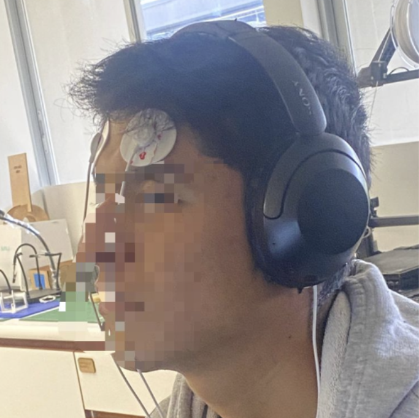
        
<strong>Figura 2:</strong> Ubicación de electrodos en el sujeto de prueba 

      

      

        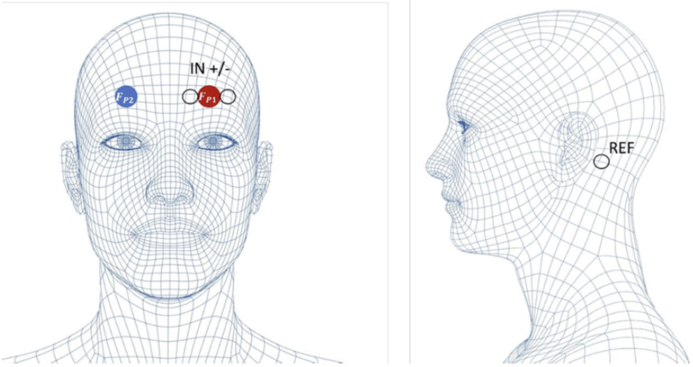
        
<strong>Figura 3:</strong> Colocación de electrodos para medir EEG en la posición FP1: Pines de medición IN+/- (izquierda) y referencia (derecha)

      

  3. **Condiciones de obtención de señal:**  
     Para la obtención de las señales, el sujeto de estudio se mantuvo en posición de sedestación, la cual fue asegurada por los investigadores para garantizar condiciones estables durante el registro. A continuación, se detallan las diferentes condiciones bajo las cuales se realizaron las mediciones:
     
| **Condición de Registro**         | **Descripción**                                                                                                          | **Duración**   |
|----------------------------------|--------------------------------------------------------------------------------------------------------------------------|----------------|
| **Basal 1 (Ojos abiertos)**      | El sujeto en sedestación fijó la mirada en un punto con los ojos abiertos.                                               | 1 minuto       |
| **Basal 2 (Ojos cerrados)**      | El sujeto cerró los ojos en un entorno oscuro controlado por los investigadores.                                         | 1 minuto       |
| **Tarea cognitiva**              | El sujeto realizó una tarea de resta en silencio (restar 7 desde 100).                                                   | 2 minutos      |
| **Estudio de artefactos**        | El sujeto parpadeó y masticó simultáneamente.                                                                            | 2 minutos      |
| **Estudio libre**                | El sujeto realizó cálculos mentales que requerían un alto grado de concentración.                                        | 6 minutos      |

 ## 4. Resultados y limitaciones 

 1. **Resultados:**  
Se presenta la tabla que muestra las señales antes y después de ser procesadas mediante un filtro pasabanda con un rango de frecuencias de 0.8 Hz a 48 Hz.

| Condición         | Señal Crudo     | Señal Filtrada  |
|-------------------|------------------|------------------|
| Basal 1           | 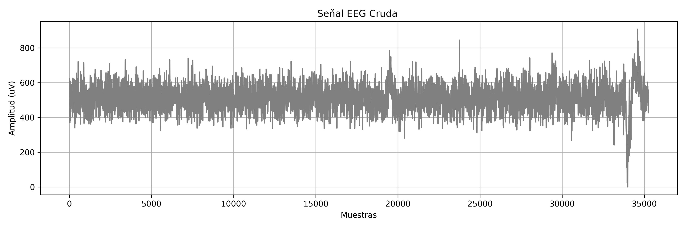 | 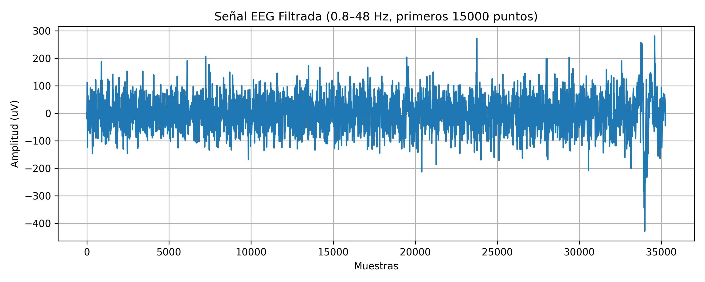 |
| Basal 2           | 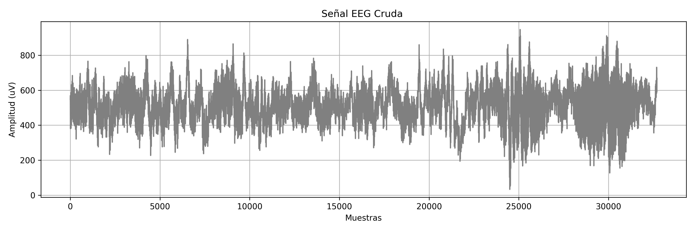 | 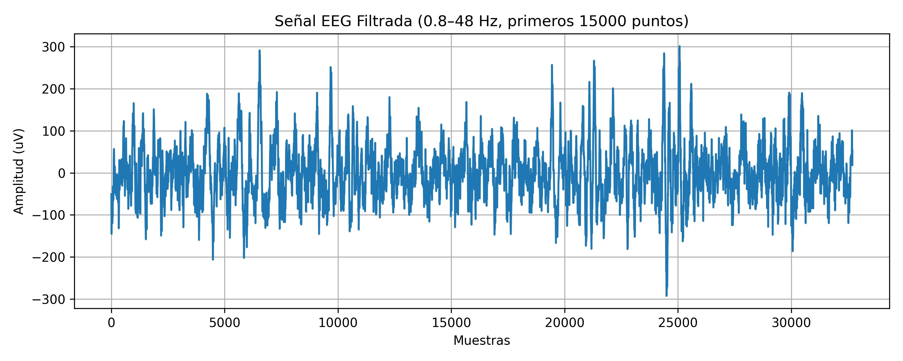 |
| Tarea cognitiva   | 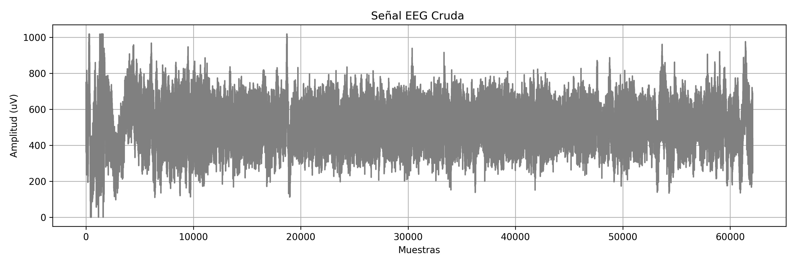  | 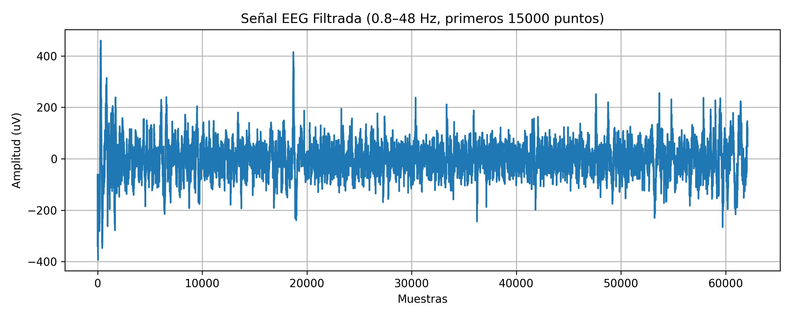  |
| Artefactos        | 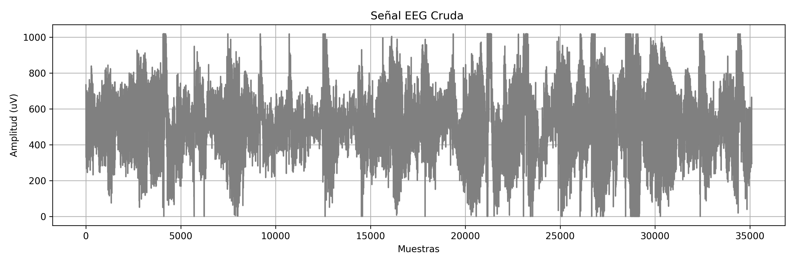 | 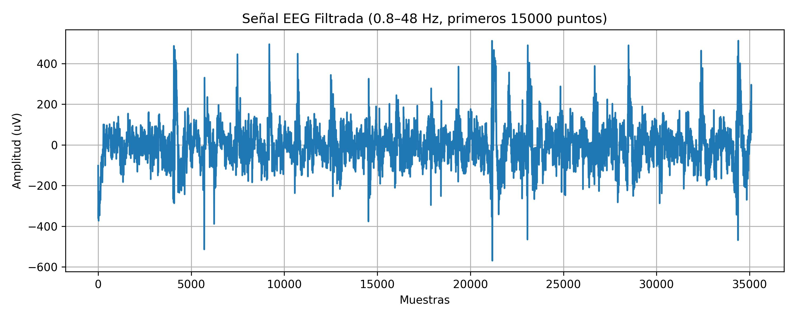 |
| Libre             |   | 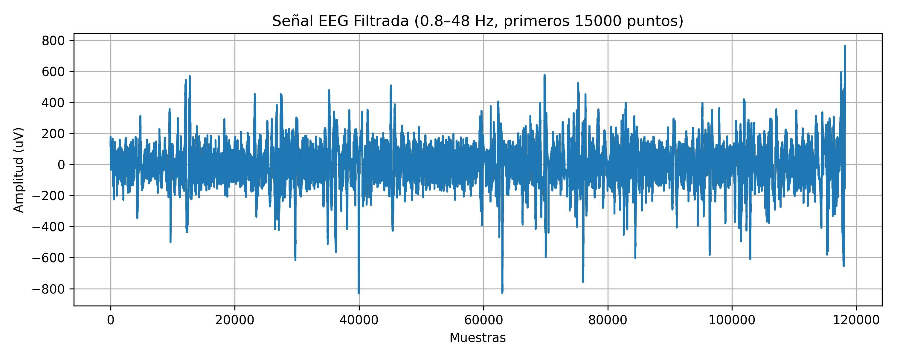  |

| Condición         | FFT Señal Filtrada    | 
|-------------------|------------------|
| Basal 1           | 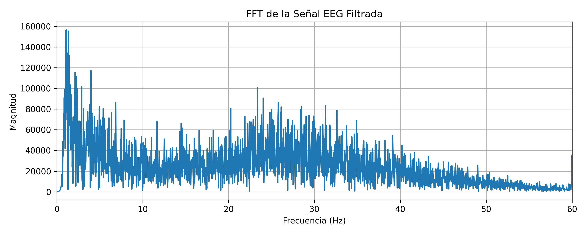 | 
| Basal 2           | 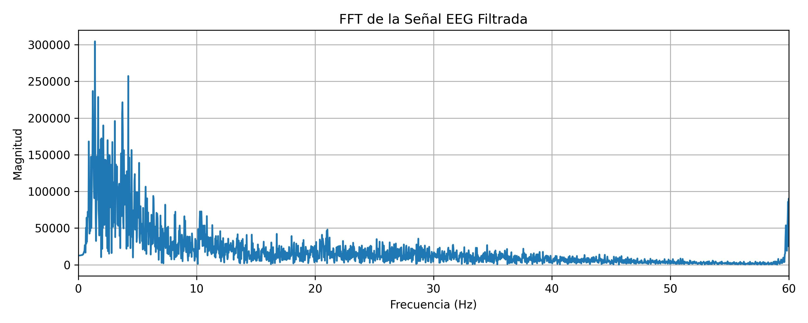 | 
| Tarea cognitiva   | 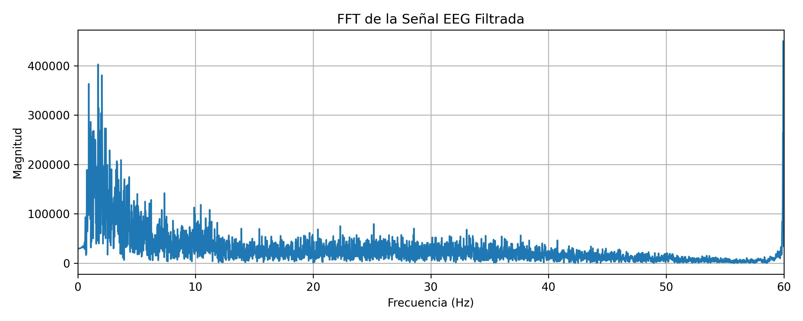  | 
| Artefactos        | 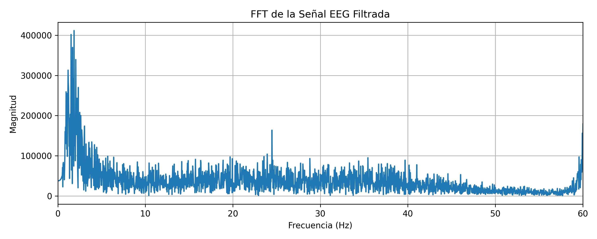 | 
| Libre             | 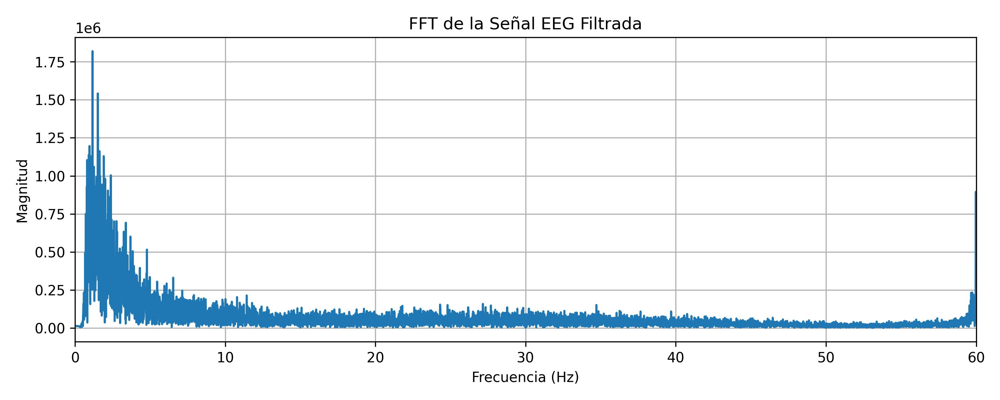  | 

### **Análisis cuantitaivo**

| Condición         |  PSD Señal Filtrada   | 
|-------------------|------------------|
| Basal 1           | 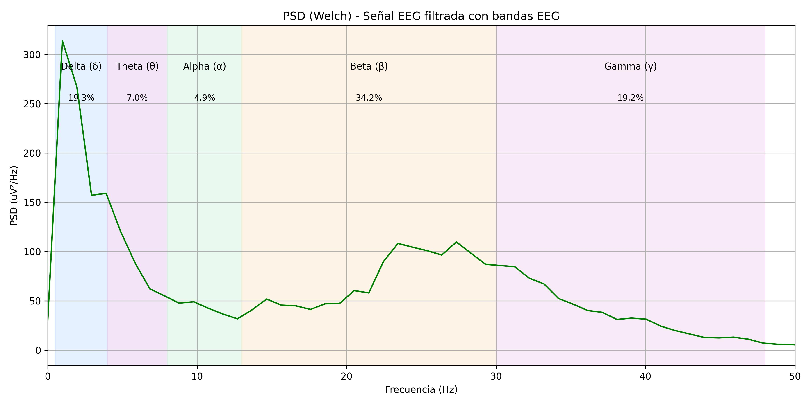 |
| Basal 2           | 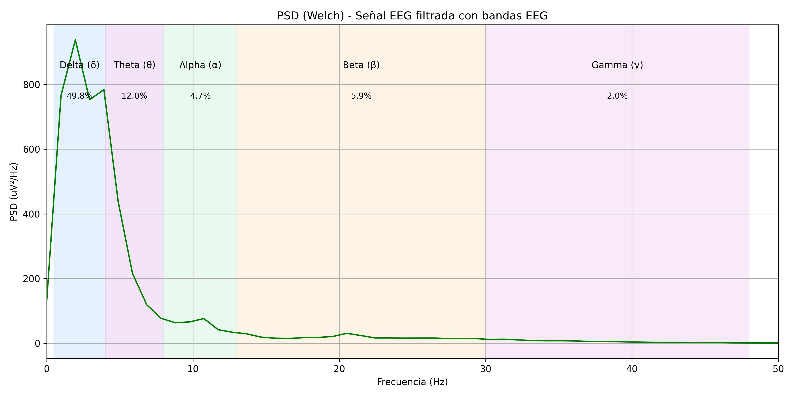 | 
| Tarea cognitiva   | 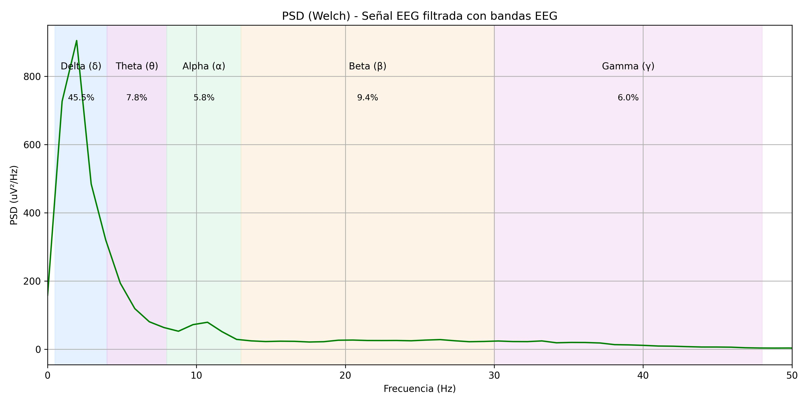  | 
| Artefactos        | 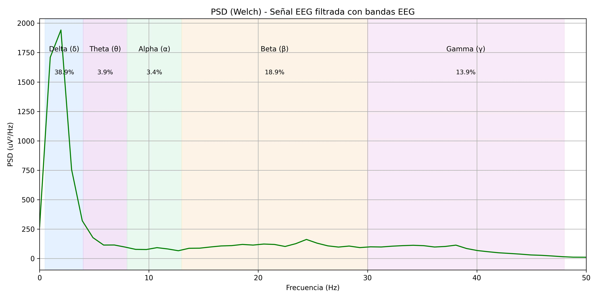 | 
| Libre             | 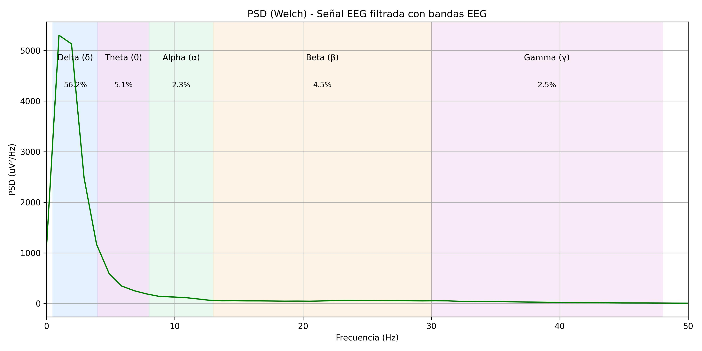  | 

**Evaluar incremento de β durante la tarea cognitiva (t‑test pareado)**

**Detectar artefactos de parpadeo (> 80 μV) y contabilizar su número**

2. **Discusión**
   - **¿Qué banda de frecuencia predomina al cerrar los ojos?**
     La frecuencia de las ondas delta según Nayak en “Formas de onda normales del EEG” corresponden a un intervalo de 0.5 a 4 Hz, mientras que las ondas beta corresponden a los valores entre 13 a 30 Hz. Durante el estudio, en la lectura de los datos de los ojos abiertos predominaron las bandas de frecuencia Beta, mientras que en los ojos cerrados predominaron las bandas de frecuencia Delta (4).

   - **¿Qué filtro es imprescindible para EEG y por qué?**
     Para el electroencefalograma es imprescindible el uso de filtros pasa banda, pues esto filtra el ruido de la señal producida por la amplificación, el filtro del hardware mencionado en la guia fue de un pasabanda de 0.8 a 48 Hz, estos valores del filtro logran suprimir suprimir artefactos de DC los cuales tienen frecuencias muy bajas y frecuencias altas por encima de 50 Hz, donde estas frecuencias corresponden a las señales electromiográficas como los son las actividades musculares de parpadeo y la frecuencia de la corriente alterna 60 Hz.(5)

   - **¿Puedes modular conscientemente tu señal EEG? Da un ejemplo.**
Se puede modular conscientemente la señal EEG a partir de la meditación, estudios demuestran que durante la Paced Breathing, un tipo de meditación Su-Soku, se produce una alteración en los parámetros del EEG, donde aumentan las ondas de baja y alta frecuencia de alpha (8-13 Hz) y decrece el potencial en ondas theta (4-8 Hz). Dentro del estudio, se logró evaluar la actividad theta la cual mejora continuamente de manera significativa en las fases secuenciales de la meditación, mientras que la actividad alfa es significativa durante la fase media avanzada (6,7)

   - **¿Se observan diferencias entre Fp1 y Fp2? ¿Por qué podrían ocurrir?**
 En un EEG es común observar diferencias entre Fp1 y Fp2 debido a la lateralización funcional del cerebro, especialmente en el procesamiento emocional. Un estudio de 2023 encontró que la actividad alfa en Fp2 se asoció con emociones positivas como la felicidad, mientras que una mayor actividad en Fp1 se vinculó con emociones negativas como tristeza y miedo, lo cual respalda el modelo de asimetría frontal afectiva (8). Asimismo, una revisión sistemática reciente indicó que la asimetría frontal alfa (FAA), incluyendo Fp1 y Fp2, podría servir como biomarcador complementario en trastornos afectivos como la depresión, aunque con efecto pequeño y alta heterogeneidad entre estudios (9).

   
3. **Limitaciones**
   - **Condiciones de iluminación**:
     Una de las limitaciones fue no haber podido realizar la actividad en un área completamente oscura. Como alternativa, se taparon los ojos del sujeto con una casaca para simular esa condición. Sin embargo, esto pudo haber causado contacto directo entre los electrodos y la prenda, además de una presión adicional que podría haber generado ruido en la señal.
   - **Distracciones e interrupciones externas:**
  Durante el experimento, se presentaron distracciones e interrupciones externas al haber varios grupos realizando el procedimiento dentro del laboratorio. Para mitigar esto, se le indicó al sujeto que usara audífonos con el fin de reducir el ruido ambiental. No obstante, los audífonos no lograron bloquear el sonido por completo, lo que podría haber afectado la concentración del sujeto y, como consecuencia, la precisión de las señales obtenidas. 
   - **Uso limitado de electrodos:**
Otra limitación fue el uso limitado de electrodos, lo cual restringió considerablemente la detección y análisis de los ritmos eléctricos que normalmente se manifiestan con mayor claridad en otras áreas del cerebro.
   - **Dificultad en la colocación de electrodos:**
   En cuanto a la colocación de los electrodos, se identificó una dificultad debido al espacio reducido entre la ceja del sujeto y el inicio del cuero cabelludo. Esto causó que algunas hebras de cabello quedaran atrapadas debajo de los electrodos, lo cual pudo haber afectado la calidad de la señal obtenida.

4. **Conclusiones:**  
   - El uso del sistema BITalino y la correcta colocación de electrodos en Fp1, Fp2 y O2 permitió registrar señales EEG representativas, identificando ritmos característicos según el estado del sujeto. Las ondas beta predominaron con ojos abiertos, mientras que las alfa se intensificaron al cerrar los ojos. Además, el filtro pasabanda de 0.8–48 Hz resultó fundamental para eliminar artefactos de baja y alta frecuencia.
   - Existen diferencias funcionales entre Fp1 y Fp2, coherentes con estudios recientes sobre asimetría frontal afectiva, donde Fp1 se asocia a emociones negativas y Fp2 a positivas. No obstante, limitaciones como la interferencia ambiental, el contacto imperfecto de los electrodos y el número reducido de canales afectaron la calidad de la señal y del análisis.
   

 ## 5. Referencias bibliográficas 
 [1] Michel CM, He B. Chapter 6 - EEG source localization [Internet]. Levin KH, Chauvel P, editors. Vol. 160, ScienceDirect. Elsevier; 2019. p. 85–101. Available from: https://www.sciencedirect.com/science/article/abs/pii/B9780444640321000060  
 [2] Kirschstein T, Köhling R. What is the source of the EEG? Clinical EEG and neuroscience [Internet]. 2009 Jul 1;40(3):146–9. Available from: https://pubmed.ncbi.nlm.nih.gov/19715175/  
 [3] Blinowska K, Durka P. ELECTROENCEPHALOGRAPHY (EEG) [Internet]. 2006. Available from: https://citeseerx.ist.psu.edu/document?repid=rep1&type=pdf&doi=d0e3a5e418f4ba8ff3ba117d45f9cc6b1d89ee7d  
 [4] Nayak CS, Anilkumar AC. EEG normal waveforms. In: StatPearls. Treasure Island (FL): StatPearls Publishing; 2025. PMID: 30969627.  
 [5] Gonçales LJ, Farias K, Kupssinskü L, Segalotto M. The effects of applying filters on EEG signals for classifying developers’ code comprehension. J Appl Res Technol. 2021;19(6):584–602. doi:10.22201/icat.24486736e.2021.19.6.1299  
 [6] Tsai JF, Jou SH, Cho W, Lin CM. Electroencephalography when meditation advances: a case-based time-series analysis. Cogn Process. 2013;14(4):371–6. doi:10.1007/s10339-013-0563-3  
 [7] Kaur C, Singh P. EEG derived neuronal dynamics during meditation: progress and challenges. Adv Prev Med. 2015;2015:614723. doi:10.1155/2015/614723  
 [8] Yuvaraj R, Murugappan M, Ahmed B, Mohamad K, Mohd Yasin M. Frontal Alpha Asymmetry as a Predictor of Emotional Response: An EEG Study. Brain Sci. 2023;13(8):1175. doi:10.3390/brainsci13081175  
 [9] .van der Vinne N, Vossen C, Arns M. Frontal alpha asymmetry as a diagnostic biomarker in major depressive disorder: A systematic review and meta-analysis. npj Mental Health Research. 2025;1(1):17. doi:10.1038/s44184-025-00117-x
