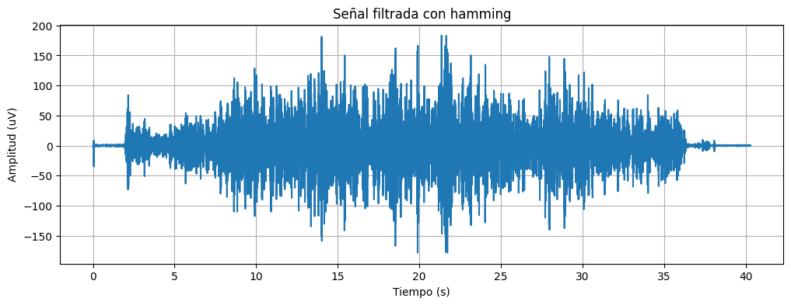

# **LABORATORIO 07: Filtros FIR  e IIR**
## **Tabla de contenidos**

1. [Filtrado de señal ECG](#n1)
2. [Filtrado de señal EMG](#n2)  
3. [Filtrado de señal EEG](#n3)
    
## **Introducción**
En el procesamiento digital de señales, los filtros digitales son herramientas fundamentales que permiten eliminar ruido, extraer información útil o modificar ciertas características de una señal. Entre los más utilizados se encuentran los filtros FIR (Finite Impulse Response) y IIR (Infinite Impulse Response). Los filtros FIR se caracterizan por tener una respuesta al impulso de duración finita, fase lineal y estabilidad inherente, lo que los hace ideales cuando se desea preservar la forma de la señal sin distorsión [1]. En cambio, los filtros IIR tienen una estructura recursiva que les otorga una respuesta infinita, lo que permite obtener características similares con menos coeficientes, a costa de una posible distorsión de fase y un mayor riesgo de inestabilidad si no se diseñan correctamente [2]. La elección entre ambos tipos de filtros depende de los requisitos específicos de la aplicación, como precisión temporal, eficiencia computacional y tolerancia a la distorsión de fase [3].
 ## 1. ECG 

### **Objetivo:**
Procesar las señales ECG para reducir el ruido y los artefactos, enfocándose en resaltar la actividad cardiaca relevante.

### **Procesamiento:**

1. **Filtro FIR**
   - Objetivo: Aislar la banda de frecuencia de interés que corresponde a la actividad cardiaca.
   - Métodos de ventana: **Hamming y  Hanning**.
   - Derivación I 
   - Especificaciones sugeridas:
     - **Frecuencia de corte (Fc): 250 Hz**. Preserva las partes fisiológicamente relevantes del ECG.
     - **Pasa bajo**

     
2. **Filtro IIR**
      - Objetivo: Eliminar las frecuencias altas asociadas a ruido eléctrico y artefactos de movimiento que interfieren con la señal ECG.
   - Filtros usados: **Butterworth y Chebyshev tipo I**
   - Derivación I 
   - Especificaciones sugeridas:
     - **Frecuencia de corte (Fc): 40 Hz**, corresponde al ruido eléctrico.
     - **Frecuencia de paso (Wp): 188 rad/s (30 Hz)**. Permite el paso de las frecuencias de interés, que son las frecuencias de la señal ECG.
     - **Frecuencia de atenuación (Ws):  50 Hz**. Define la frecuencia a partir de la cual las señales no deseadas se atenúan de forma significativa.
   

| Campo de Actividad| Señal Cruda     | Filtros FIR         | Filtros IIR     |
|-------------------|------------------|------------------|------------------|
| Descanso           |  |  |  |
| Contracción leve   |  |  |  |
| Contracción fuerte |   |   |  |

 ### Comparación de filtros FIR
 

En la comparación entre los filtros FIR diseñados con ventanas Hamming y Hanning para el procesamiento de señales ECG, se observa que el filtro con ventana Hamming presenta una transición más abrupta y una mayor atenuación en la banda de parada (\~60 dB), lo que lo hace más efectivo para eliminar ruido de alta frecuencia, como interferencias eléctricas o artefactos musculares. En cambio, la ventana Hanning ofrece una transición más suave pero con menor capacidad de rechazo fuera de banda (\~45 dB), lo que puede permitir el paso de componentes no deseados. Dado que en el análisis de ECG es crucial conservar la forma de onda y minimizar el ruido que pueda afectar la interpretación de intervalos clínicos como PR, QRS o QT, el uso de la ventana Hamming resulta más apropiado, ya que proporciona una mejor supresión del ruido sin distorsionar la señal fisiológica.

 ### Comparación con filtros IIR

Antes de aplicar el filtro a cada señal, se hizo una comparación de su respuesta en frecuencia y el porque nos sirve cada uno. Primero vimos que el filtro Chebyshev tuvo unas ondulaciones previas a su brusca caída mientras que el filtro Butterworth mostro una caída más atenuada y larga, sin esas ondulaciones en la frecuencia de corte. Para este caso particular es más recomendable usar el filtro Chebyshev, pues no nos afecta tanto ese retraso del filtro en la señal con respecto a las otras frecuencias debido a que el ruido también tiene una forma amplia que llega hasta los 200 Hz. Por otro lado el filtro Chebyshev podría habernos sido más útil en caso de notar mucho ruido debido a las corrientes por ejemplo, que está en 60 Hz y podríamos haber necesitado un corte más abrupto para no tener problemas con nuestra señal. Igualmente como se vio en ambas señalas filtradas, debido al grado de los filtros probados, no hubo mucha diferencia entre ambos, sin embargo al buscar ampliar este grado si podría a llegar a notarse esas diferencias mencionadas y en todo caso buscar el criterio que mejor se hubiera creído

 ## 2. EMG 

### **Objetivo:**
Procesar las señales EMG para reducir el ruido y los artefactos, enfocándose en resaltar la actividad muscular relevante.

### **Procesamiento:**

1. **Filtro FIR**
   - Objetivo: Aislar la banda de frecuencia de interés que corresponde a la actividad muscular.
   - Métodos de ventana: **Hamming y Blackman**.
   - Especificaciones sugeridas:
     - **Frecuencia de corte (Fc): 40 Hz**. Solo las frecuencias asociadas a la actividad muscular (por debajo de 40 Hz) se mantienen.
     - **Pasabanda bajo**

     
2. **Filtro IIR**
   - Objetivo: Eliminar las frecuencias altas asociadas a ruido eléctrico y artefactos de movimiento que interfieren con la señal EMG.
   - Filtros usados: **Butterworth y Chebyshev tipo I**
   - Especificaciones sugeridas:
     - **Frecuencia de corte (Fc): 60 Hz**, corresponde al ruido eléctrico y los artefactos de movimiento.
     - **Frecuencia de paso (Wp): 188 rad/s (30 Hz)**. Permite el paso de las frecuencias de interés, que son las frecuencias más bajas de la señal EMG.
     - **Frecuencia de atenuación (Ws): 300 rad/s (47.75 Hz)**. Define la frecuencia a partir de la cual las señales no deseadas se atenúan de forma significativa.
   

| Campo de Actividad| Señal Cruda     | Filtros FIR         | Filtros IIR     |
|-------------------|------------------|------------------|------------------|
| Descanso           |  |  |  |
| Contracción leve   |  |  |  |
| Contracción fuerte |   |   |  |

 ### Comparación de filtros FIR
 

Se puede observar que aunque los filtros comparten las mismas especificaciones, también presentan diferencias sutiles en su comportamiento espectral.
Primero, en la **ventana Blackman** se muestra una atenuación más pronunciada en las frecuencias fuera de la banda de interés, lo cual se puede traducir en una reducción más agresiva del contenido de alta frecuencia. Por otro lado, la **ventana Hamming** presenta un espectro más elevado en la zona de atenuación, lo que indica que es un poco más permisiva en cuanto al contenido fuera de la banda.
Sin embargo, en general, ambos filtros cumplen con el objetivo planteado, el cual es aislar la banda de actividad muscular, pero el filtro con ventana Blackman resulta más eficiente en la supresión de ruido de alta frecuencia.

 ### Comparación con filtros IIR

A pesar de que los filtros comparten las mismas especificaciones de diseño, se observan variaciones en sus respuestas espectrales. La señal filtrada con el **filtro Butterworth** presenta una transición suave entre la banda pasante y la banda de rechazo, con una atenuación gradual de las frecuencias más altas, sin generar rizado ni distorsión aparente. En contraste, el **filtro Chebyshev tipo I** ofrece una caída más abrupta en la banda de rechazo; sin embargo, este rendimiento viene acompañado de ondulaciones o rizado en la banda pasante, visibles especialmente en las frecuencias iniciales, lo que puede introducir cierta distorsión en la señal dentro del rango útil. En conclusión, el **filtro Butterworth** ofrece una respuesta más suave, ideal para aplicaciones donde la calidad de la señal es crítica ya que no atenúa de manera agresiva. En contraste, el **filtro Chebyshev tipo I** elimina mejor el ruido porque atenúa más rápido las frecuencias no deseadas, pero puede alterar un poco la señal útil debido al rizado en la banda pasante.

 ## 3. EEG 

### **Objetivo:**
Preprocesar las señales EEG para reducir el ruido y extraer caracteristicas de interes como ondas cerebrales especificas.

### **Procesamiento:**

1. **Filtro IIR**
   - Filtro: Butterworth
   - Especificaciones sugeridas:
     - **Frecuencia de corte (Fc): 30 Hz**. Solo las frecuencias asociadas a la actividad cerebral (por debajo de 30 Hz) se mantienen.
     - **Pasabajos**
     - **Frecuencia de paso (Wp): 188 rad/s (30 Hz)**. Permite el paso de las frecuencias de interés, que son las frecuencias más bajas de la señal EMG.
     - **Frecuencia de atenuación (Ws): 300 rad/s (47.75 Hz)**. Define la frecuencia a partir de la cual las señales no deseadas se atenúan de forma significativa.

2. **Filtro FIR**
   - Objetivo: Extraer bandas de frecuencia especificas (alfa, beta, etc.).
   - Filtros usados: **Hamming**
   - Especificaciones sugeridas:
     - **Frecuencias de corte (Fc): 8-12 Hz**, pasa banda para ondas alfa.

| Campo de Actividad| Señal Cruda     | Filtros FIR         | Filtros IIR     |
|-------------------|------------------|------------------|------------------|
| Basal           ||||
| Ojos Cerrados   ||| |
| Preguntas ||||

 ### Comparación de filtros FIR

|Basal     | Ojos Cerrados         | Preguntas     |
|------------------|------------------|------------------|
||||

adalksmdlaks **ventana Hamming** 

 ### Comparación con filtros IIR
|Basal     | Ojos Cerrados         | Preguntas     |
|------------------|------------------|------------------|
||||

laksmdlaksmd **filtro Butterworth** 

## **Referencias**

[1] Quantum Machines, “Introduction to Digital Filters – Part 1: First Things First,” Quantum Machines Blog, 2023. [En línea]. Disponible en: https://www.quantum-machines.co/blog/introduction-to-digital-filters-01-first-things-first/

[2] Advanced Solutions Nederland (AdvSolned), “Difference Between IIR and FIR Filters – A Practical Design Guide,” 2024. [En línea]. Disponible en: https://www.advsolned.com/difference-between-iir-and-fir-filters-a-practical-design-guide/

[3] K. K. Sharma and A. Kumar, “Performance Comparison of FIR and IIR Filters for Digital Signal Processing,” International Journal of Engineering Research & Technology (IJERT), vol. 12, no. 1, pp. 45–49, 2023.
