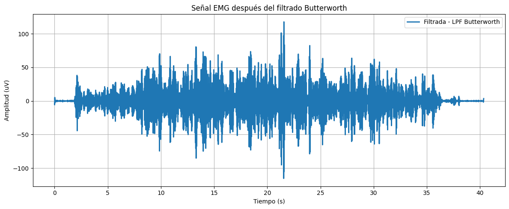

# **LABORATORIO 07: Filtros FIR  e IIR**
## **Tabla de contenidos**

1. [Filtrado de señal ECG](#n1)
2. [Filtrado de señal EMG](#n2)  
3. [Filtrado de señal EEG](#n3)  

 ## 1. ECG 

 ## 2. EMG 

### **Objetivo:**
Procesar las señales EMG para reducir el ruido y los artefactos, enfocándose en resaltar la actividad muscular relevante.

### **Procesamiento:**

1. **Filtro FIR**
   - Objetivo: Aislar la banda de frecuencia de interés que corresponde a la actividad muscular.
   - Métodos de ventana: **Hamming y Blackman**.
   - Especificaciones sugeridas:
     - **Frecuencia de corte (Fc): 40 Hz**. Solo las frecuencias asociadas a la actividad muscular (por debajo de 40 Hz) se mantienen.
     - **Pasabanda bajo**

     
3. **Filtro IIR**
   - Objetivo: Eliminar las frecuencias altas asociadas a ruido eléctrico y artefactos de movimiento que interfieren con la señal EMG.
   - Filtros usados: **Butterworth y Chebyshev tipo I**
   - Especificaciones sugeridas:
     - **Frecuencia de corte (Fc): 60 Hz**, corresponde al ruido eléctrico y los artefactos de movimiento.
     - **Frecuencia de paso (Wp): 188 rad/s (30 Hz)**. Permite el paso de las frecuencias de interés, que son las frecuencias más bajas de la señal EMG.
     - **Frecuencia de atenuación (Ws): 300 rad/s (47.75 Hz)**. Define la frecuencia a partir de la cual las señales no deseadas se atenúan de forma significativa.
   

| Campo de Actividad| Señal Cruda     | Filtros FIR         | Filtros IIR     |
|-------------------|------------------|------------------|------------------|
| Descanso           |  |  |  |
| Contracción leve   |  |  |  |
| Contracción fuerte |   |   |  |

 ### Comparación de filtros FIR
 

Se puede observar que aunque los filtros comparten las mismas especificaciones, también presentan diferencias sutiles en su comportamiento espectral.
Primero, en la **ventana Blackman** se muestra una atenuación más pronunciada en las frecuencias fuera de la banda de interés, lo cual se puede traducir en una reducción más agresiva del contenido de alta frecuencia. Por otro lado, la **ventana Hamming** presenta un espectro más elevado en la zona de atenuación, lo que indica que es un poco más permisiva en cuanto al contenido fuera de la banda.
Sin embargo, en general, ambos filtros cumplen con el objetivo planteado, el cual es aislar la banda de actividad muscular, pero el filtro con ventana Blackman resulta más eficiente en la supresión de ruido de alta frecuencia.

 ### Comparación con filtros IIR

A pesar de que los filtros comparten las mismas especificaciones de diseño, se observan variaciones en sus respuestas espectrales. La señal filtrada con el **filtro Butterworth** presenta una transición suave entre la banda pasante y la banda de rechazo, con una atenuación gradual de las frecuencias más altas, sin generar rizado ni distorsión aparente. En contraste, el **filtro Chebyshev tipo I** ofrece una caída más abrupta en la banda de rechazo; sin embargo, este rendimiento viene acompañado de ondulaciones o rizado en la banda pasante, visibles especialmente en las frecuencias iniciales, lo que puede introducir cierta distorsión en la señal dentro del rango útil. En conclusión, el **filtro Butterworth** ofrece una respuesta más suave, ideal para aplicaciones donde la calidad de la señal es crítica ya que no atenúa de manera agresiva. En contraste, el **filtro Chebyshev tipo I** elimina mejor el ruido porque atenúa más rápido las frecuencias no deseadas, pero puede alterar un poco la señal útil debido al rizado en la banda pasante.

 ## 3. EEG 

