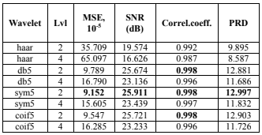
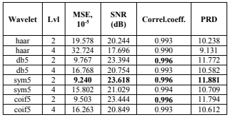
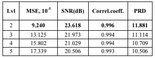
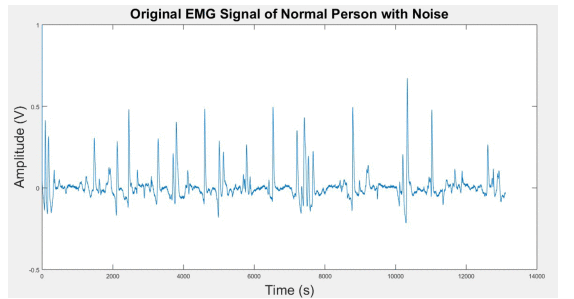
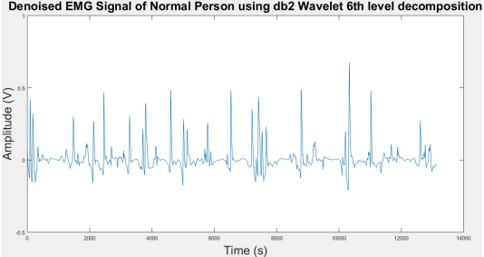
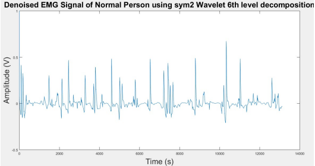
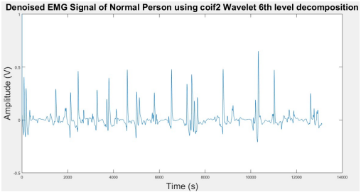

# **LABORATORIO 08: Transformada Wavelet**
## **Tabla de contenidos**

1. [Introducción: Mother Wavelet](#n1)
2. [Propósito de la práctica](#m1)
3. [Mother Wavelet en Señales ECG](#n2)  
4. [Mother Wavelet en Señales EMG](#n3)  
5. [Mother Wavelet en Señales EEG](#n4)
6. [Referencias bibliográficas](#n5)

 ## 1. Introducción: Mother Wavelet [1] 
El Wavelet permite analizar señales no estacionarias al descomponerlas en componentes conocidos como wavelets, pequeñas formas de onda oscilatorias localizadas tanto en el tiempo 
como en la frecuencia. La ondícula original se genera a partir de una ondícula original denominada ondícula madre `ψ(t)`, a partir de la cual se genera una familia de ondículas 
mediante escalado y traslación para analizar las señales no estacionarias en la banda de frecuencia. A diferencia de los métodos tradicionales, como las transformadas de Fourier, 
las transformadas wavelet (WT) no requieren el supuesto de estacionariedad o periodicidad de la señal, son buenas para señales con discontinuidades.

 ## 2. Propósito de la práctica 
- Analizar estudios en el uso de distintas funciones Mother Wavelet en el procesamiento de señales biomédicas (ECG, EMG y EEG).
- Comparar el desempeño de diferentes familias de wavelets madre en la eliminación de ruido y conservación de características relevantes.
- Comprender los criterios técnicos utilizados para seleccionar la Mother Wavelet adecuada según el tipo de señal y aplicación clínica.

 ## 3. Mother Wavelet en Señales ECG 
### Analysis of Wavelet Transform Application for Filtering Real ECG Signals from High-Frequency Noise [2] 
Este artículo evalúa las mejores opciones de procesado para señales ECG. Para esto primero define cuales son los ruidos más generales que tiene la señal 
ECG y qué tipo de señal es descrita. Según este artículo la señal ECG es un tipo de señal no estacionaria, que significa que con el tiempo puede mostrar
variaciones de su frecuencia que en este caso pueden representar posibles enfermedades cardiacas que debemos registrar de manera precisa, sin
embargo esto muchas veces no es posible de primeras por la cantidad de ruido con la que se obtiene la señal, ya sea por una mal colocamiento
del electrodo con la piel, la respiración del paciente o interferencias eléctricas de otros dispositivos electrónicos de los cuales ya se 
tiene una aproximación de la frecuencia con la que trabajan.  

#### Metodología:  
Se usó 2 databases para poder realizar los análisis correspondientes. El primero fue uno generado por ellos, conformado por 13 pacientes
con 12 derivaciones donde consiguieron 169 señales. Mientras que el otro dataset lo adquirieron de PTB Diagnostic ECG Database, 
donde se sacó 8265 señales de 549 pacientes, con señales mucho más trabajadas y limpias que las del primer data set. De todas estas
señales se hicieron 2 divisiones más, que fueron la señal en crudo como tal y la señal procesada con un filtro de Fourier pasa bajo.   

Ellos han elegido 4 tipos de wavelet para hacer este experimento [3]:  
- **Haar:** De las Wavelets más antiguas y simples que existen, sin embargo es por esa antigüedad que al final tiene unos resultados algo toscos [4].
- **Daubechies:** Aunque Matlab lo mencione como lo mismo que la Wavelet Haar, está en verdad es más suave y precisa que la última mencionada y permite el uso de las wavelets con señales discretas.
- **Symlet:** Una modificación de la wavelet Daubechie, donde la función se vuelve más simétrica, lo que nos otorga una buena fidelidad de la transformada.
- **Coiflet:** Su diferencia con las demás es que se sobrelapa más, pero usando la misma estructura que las 2 primeras.  

Otros parámetros que se seleccionaron fueron el método, el modo y los niveles de cada wavelet. En el caso del método y el modo quedaron 
como constantes siendo la elección “visushrink” y soft respectivamente. Por otro lado se probó primero con los niveles 2 y 4 para cada 
wavelet, pero cuando ya hubo una que se mostró superior, se hizo pruebas hasta el nivel 5.  

Finalmente los parámetros que se analizaron fueron:  
- Mean Squared Error (MSE): Que es el error cuadrático de la media entre la señal original y la filtrada
- Signal to noise ratio
- Coeficiente de correlación
- Diferencia porcentual respecto al original (PRD)

#### Resultados:  

Primer data set:  

        
        
<strong>Tabla 1:</strong> Resultados de la aplicación de filtros wavelet al primer conjunto de datos, sin preprocesamiento con un filtro de Fourier pasa bajo. 

      
 

        
        
<strong>Tabla 2:</strong> Resultados de la aplicación de filtros wavelet al primer conjunto de datos, con preprocesamiento utilizando un filtro de Fourier pasa bajo. 

      
 

Segundo Data set:  

        
        
<strong>Tabla 3:</strong> Resultados de la aplicación de filtros wavelet al segundo conjunto de datos. 

      
 

Comparación final de niveles con el 1er data set:  

        
        
<strong>Tabla 4:</strong> Resultados de la limpieza de la señal con el filtro wavelet SYM5 en varios niveles de descomposición. 

      
 

#### Discusión:  
Como se puede observar en las primera tres tablas, el que tuvo mejor resultado fue la wavelet SYM5 de nivel 2 que obtuvo el menor MSE,
el mayor SNR e igualó con el mayor coeficiente de correlación en el primer database. Sin embargo en el segundo database el que quedó 
como el más eficaz fue el coif5 de segundo nivel que obtuvo mejores resultados que el SYM5. Por otro lado el que obtuvo los peores
resultados fue el Haar y pudimos ver que más nivel no siempre significa mejor resolución, como en estos casos que se vio que mientrás
más se aumentaba el nivel de la wavelet, peores resultados terminaban teniendo, recomendado como tal el nivel 2 para un correcto 
análisis del ECG. 

 ## 4. Mother Wavelet en Señales EMG 
### Noise Removal of EMG Signal for Healthy Person Using Wavelet Decomposition Method with Three Different Wavelet Families to Identify the Best Wavelet for Noise Removal [5] 

#### Objetivo:      
Identificar la mejor familia de wavelets (Daubechies, Symlet o Coiflet) para eliminar el ruido en señales de electromiografía (EMG) 
en individuos sanos. Para ello, se utiliza la descomposición wavelet y se estima la Relación Señal-Ruido (SNR) con el fin de evaluar 
la eficacia de cada wavelet madre en el procesamiento de la señal biomédica.

#### Antecedentes: 
El procesamiento de señales biomédicas, como el EMG, es esencial para analizar la actividad muscular, pero estas señales suelen estar 
contaminadas con ruido técnico y biológico. Diversos estudios han aplicado técnicas como descomposición en modos empíricos, filtros 
medianos y transformadas wavelet para mejorar su calidad. Sin embargo, la mayoría se ha centrado en wavelets específicas, como las 
Daubechies, sin comparar de manera exhaustiva otras familias. Por ejemplo, Veer et al. (2014) identificaron a la wavelet db4 como 
la más eficaz. Más recientemente, se han desarrollado filtros adaptativos e incluso redes neuronales para estimar la SNR y optimizar 
la limpieza de señales EMG contaminadas. Este estudio surge de la necesidad de comparar distintas familias de wavelets para identificar 
cuál ofrece el mejor desempeño en la eliminación de ruido en señales EMG de personas sanas.

#### Metodología:  
- **Datos:** Señales EMG de sujetos sanos obtenidas de [emg lab.net.](emg lab.net.)
- **Descomposición Wavelet:** Se probaron tres wavelets madre (Daubechies2, Symlet2, Coiflet2) en los niveles de descomposición 4°, 5° y 6°.
- **Umbralización:** Se aplicó umbralización universal a los coeficientes de detalle para eliminar el ruido. 
- **Cálculo del SNR:** Se estimó el SNR para evaluar la efectividad de cada wavelet.

#### Resultados y discusión:  
La representación gráfica de la señal EMG ruidosa y de la señal EMG tras eliminar el ruido se muestra en las figuras a continuación.
La programación se realizó en MATLAB.  
 

        
        
<strong>Figura 1:</strong> Señal ruidosa original 

      
 

Señales filtradas con las 3 familias en el 6° nivel:  

| Daubechies2 - 6°nivel        | Symlet2 - 6°nivel   | Coiflet2 - 6°nivel |
|-------------------|------------------|------------------|
| |  |  |

Coiflet2 superó consistentemente a las demás, obteniendo los mayores valores de SNR (22.04 dB en 4° nivel, 22.44 dB en 5° y 22.49 dB en 6°), 
mientras que Daubechies2 y Symlet2 obtuvieron resultados idénticos pero inferiores (21.37 dB, 21.68 dB y 21.73 dB respectivamente).  

TABLA  
La superioridad de Coiflet2 se confirmó al validarse en 10 sujetos adicionales, destacando su potencial para aplicaciones clínicas donde la precisión en señales EMG es crítica, 
como en diagnósticos neuromusculares o sistemas protésicos.  

#### Conclusión:  
Coiflet2 es la wavelet más efectiva para eliminar ruido en señales EMG de individuos sanos, superando a las wavelets Daubechies2 y Symlet2. El estudio sugiere extender este análisis a señales
EMG de pacientes con trastornos neuromusculares, como ELA o miopatía.     

 ## 5. Mother Wavelet en Señales EEG 
### Selection of Mother Wavelet Functions for Multi-Channel EEG Signal Analysis during a Working Memory Task [6]  

Se realizó un estudio comparativo para seleccionar la función madre wavelet entre 45 funciones wavelet siendo las familias Daubechies,
Symlets y Coiflets las más significativas. Dentro del estudio, la función sym9 correspondiente a Symlets fue la que mejor se 
correlacionó con las señales EEG.  

La sección de métodos del estudio consistió en adquisición de señales EEG, análisis wavelet y análisis estadístico.  

Sobre la adquisición de señales donde se intervino a 10 sujetos sanos con una edad media de 47.9 años y sin antecedentes neurológicos.
Para la obtención de las señales se emplearon 19 electrodos, los cuales cumplen estar en el rango de 10 a 20 electrodos según el sistema
internacional. Finalmente se le pidió a los sujetos de estudio memorizar 5 palabras con ojos cerrados durante 60 segundos.
Sobre el análisis de wavelet se empleó la transformada wavelet discreta donde se probaron 45 funciones madre wavelet de familias
ortogonales aplicada en 5 regiones (frontal, temporal, parietal, occipital y central), sobre la frecuencia se separó en 5 niveles
(delta a gamma). Finalmente se empleó el método estadístico ANOVA para identificar diferencias significativas en las correlaciones.  

IMAGEN  

Se mencionó que se probaron 45 funciones madre wavelet, de las cuales destacan las funciones wavelet sym9, coif3 y  db7; Symlets (1-20),
Coiflets (1-5) y Daubechies (1-20) respectivamente.  

IMAGEN  

Las imágenes presentadas representan la correlación entre la función y las 2 regiones estudiadas dentro del estudio, además se debe tomar en cuenta que la precisión del estudio del ANOVA permite notar que la correlación de Sym9 es 
mayor a 0.5 siendo el máximo 1.  

De esta forma en la conclusión del estudio se identificó que Sym9 es la más compatible para las señales EEG en todas las regiones del 
cuero cabelludo mencionadas en la metodología.   

 ## 6. Referencias bibliográficas 
[1] Siva Ramakrishna Madeti, and S.N Singh. “A Comprehensive Study on Different Types of Faults and Detection Techniques for Solar Photovoltaic System.” Solar Energy, vol. 158, 17 Oct. 2017, pp. 161–185, www.sciencedirect.com/topics/engineering/wavelet-theory#:~:text=%2Dtransform%20(WT)-,The%20wavelet%20theory%20is%20a%20mathematical%20model%20for%20non%20stationary,stationary%20or%20periodicity%20of%20signal, https://doi.org/10.1016/j.solener.2017.08.069.  
[2] Noskova, Evgeniya, and Dmitrii Tumakov. “Analysis of Wavelet Transform Application for Filtering Real ECG Signals from High-Frequency Noise.” 2024 26th International Conference on Digital Signal Processing and Its Applications (DSPA), 27 Mar. 2024, pp. 1–5, ieeexplore.ieee.org/document/10510072, https://doi.org/10.1109/dspa60853.2024.10510072.  
[3] “Introduction to Wavelet Families - MATLAB & Simulink.” Mathworks.com, 2025, www.mathworks.com/help/wavelet/gs/introduction-to-the-wavelet-families.html.  
[4] “(PDF) Aplicación de La Wavelet Haar Para Reconstruir La Función F(T)=T Sobre El Intervalo [-3,3] En Diferentes Grados de Resolución.” ResearchGate, 2025, www.researchgate.net/publication/44131124_Aplicacion_de_la_wavelet_haar_para_reconstruir_la_funcion_ftt_sobre_el_intervalo_-33_en_diferentes_grados_de_resolucion.  
[5] Dubey, Alok, et al. Noise Removal of EMG Signal for Healthy Person Using Wavelet Decomposition Method with Three Different Wavelet Families to Identify the Best Wavelet for Noise Removal. 4 July 2024, pp. 1–7, https://ieeexplore.ieee.org/document/10866342.  
[6] Al-Qazzaz, N. K., et al. Selection of Mother Wavelet Functions for Multi-Channel EEG Signal Analysis during a Working Memory Task. 2015, pp. 29015–29035, https://doi.org/10.3390/s151129015.  
