# **LABORATORIO 09: EMG**
## **Tabla de contenidos**

1. [Ejercicio A : Simulación de distintos grados de asimetría](#n1)
2. [Ejercicio B : Índices de fatiga – pendiente de RMS vs. pendiente de frecuencia](#n2)

 ## 1. Ejercicio A : Simulación de distintos grados de asimetría <a name="n1"></a>
 ### Objetivo: Estudiar cómo varía el Symmetry Ratio al alterar la amplitud relativa del músculo “izquierdo”.
 Tarea:
    Simula cinco pares de señales EMG idénticas (burst_number=10, noise=0.01) y escala el segundo canal al 20 %, 40 %, 60 %, 80 % y 100 % de la amplitud original.
    Para cada par, limpia con nk.emg_clean(), extrae la envolvente con nk.emg_amplitude() y calcula el Symmetry Ratio.
    Grafica en un único plot de barras el ratio obtenido frente al %% de escala utilizado.
    Pregunta de reflexión: ¿A partir de qué nivel de desbalance la simetría cae por debajo de un umbral “aceptable” (p.ej. 80 %)?

[link del colab](https://colab.research.google.com/drive/1nlcD6l3YhqpRCKaE_su5G1Pc3AEmhgkB?usp=sharing)

Primero, se instalan las librerías necesarias:
```
!pip install -U neurokit2
!pip install pywavelets
!pip install numpy
```
Segundo, se importan las librerías deseadas:
```
import neurokit2 as nk
import numpy as np
import matplotlib.pyplot as plt
```
Sabiendo que los parámetros deben ser:
- Parametros pedidos
- Sampleo = 1000
- Duracion = 20
- N = 10
- Ruido = 0.01
```
scales = [0.2, 0.4, 0.6, 0.8, 1.0]
ratios = []

emg_der = nk.emg_simulate(duration=10, sampling_rate=1000,
                         burst_number=10, noise=0.01)

clean_der = nk.emg_clean(emg_der, sampling_rate=1000)
amp_der = nk.emg_amplitude(clean_der)
rms_der = np.mean(amp_der)
emg_izq = nk.emg_simulate(duration=10, sampling_rate=1000,
                         burst_number=10, noise=0.01)

for scale in scales:
  emg_musculo_izquierdo = emg_izq * scale
  clean_izq = nk.emg_clean(emg_musculo_izquierdo, sampling_rate=1000)
  signals, info = nk.emg_process(emg_left, sampling_rate=1000)
  amp_izq = nk.emg_amplitude(clean_izq)
  rms_izq = np.mean(amp_izq)
  symmetry = (min(rms_der, rms_izq) / max(rms_der, rms_izq)) * 100
  nk.emg_plot(signals, info)
  ratios.append(symmetry)
  plt.figure()
  plt.bar(["Derecho", "Izquierdo"], [rms_der, rms_izq])
  plt.title(f"Comparación de RMS Promedio - Escala {scale}")
  plt.ylabel("RMS (µV)")
  plt.show()
```
Además:
```
for i in range(len(scales)):
  print(f"Escala {scales[i]}: {ratios[i]:.1f}%")
```
El cual nos da como resultado:
- Escala 0.2: 4.1%
- Escala 0.4: 16.2%
- Escala 0.6: 36.5%
- Escala 0.8: 64.9%
- Escala 1.0: 98.6%

Las gráficas son las siguientes:

| Gráfica EMG | Barras EMG   |
|-------------------|------------------|
| 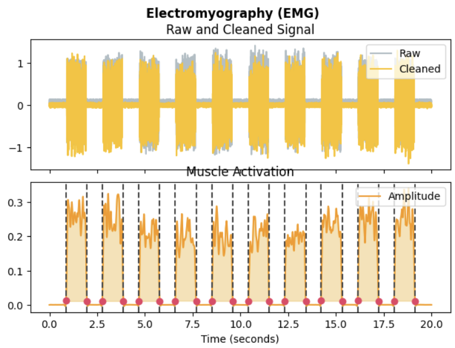| 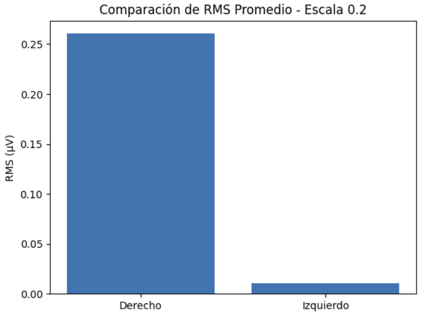 | 
| 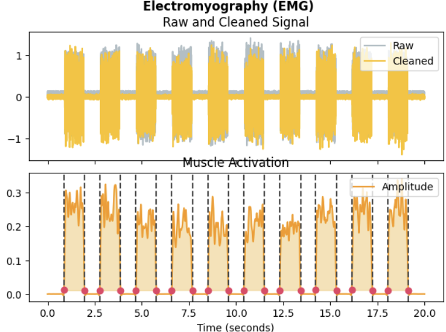| 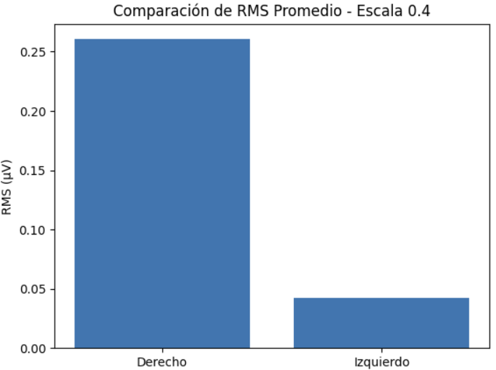 | 
| 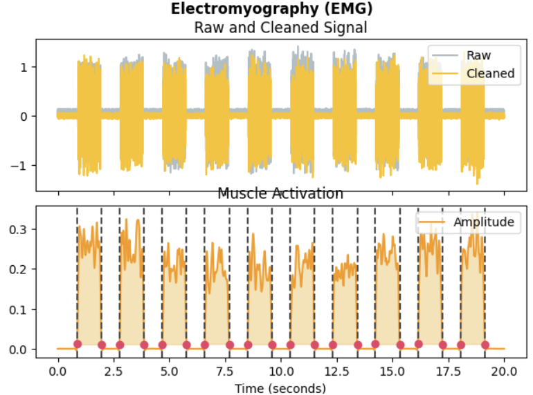| 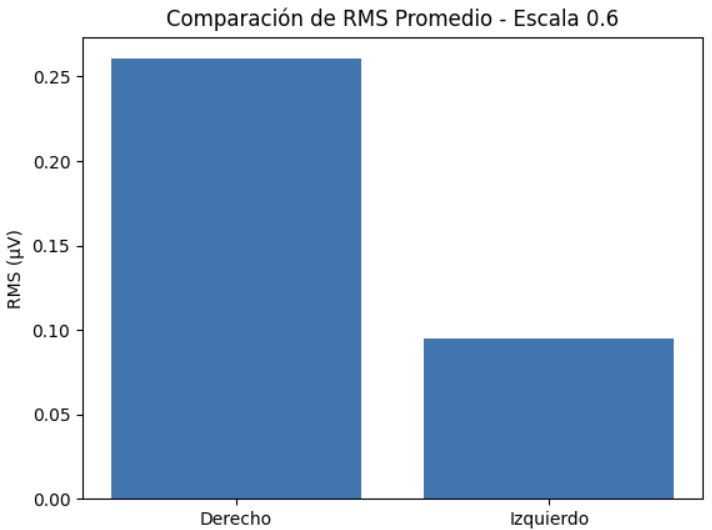 | 
| 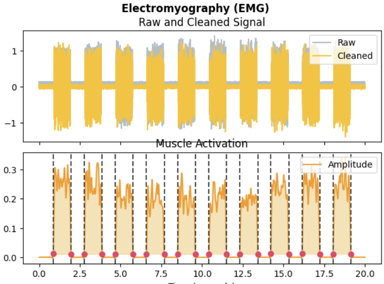| 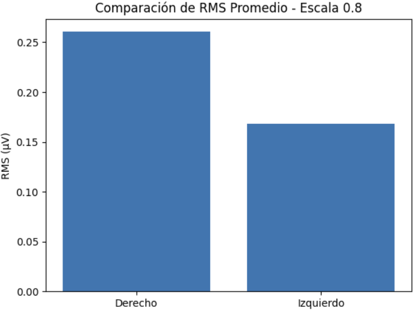 | 
| 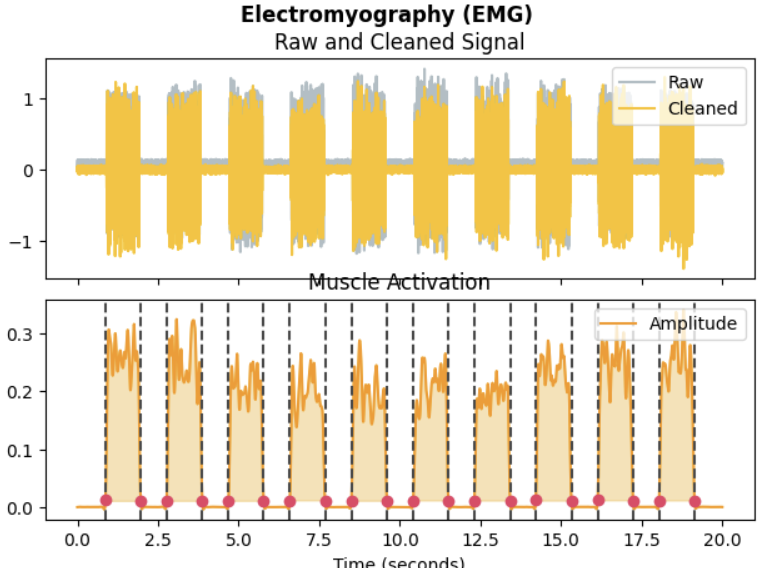| 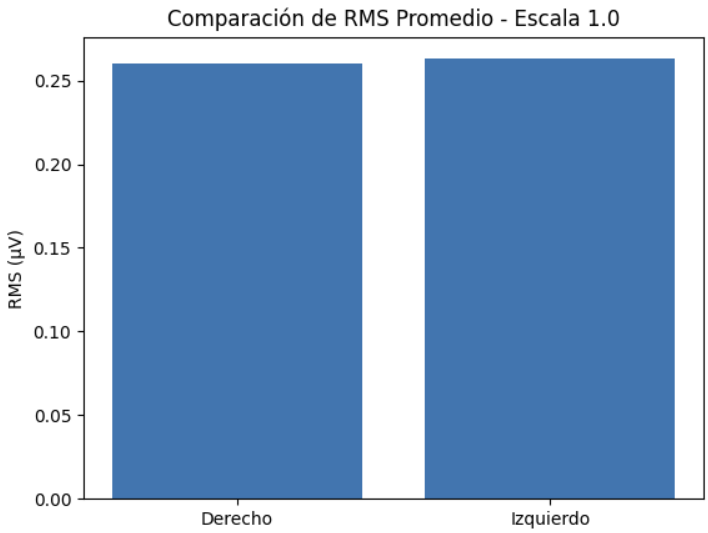 | 

Respondiendo la pregunta:
- ¿A partir de qué nivel de desbalance la simetría cae por debajo de un umbral “aceptable” (p.ej. 80 %)?

Las escalas menores a 0.8 suponen un desbalance mayor al 20%, por lo que una escala aproximada de 0.9 podria corresponder a un desbalance aceptable.


## 2. Ejercicio B : Índices de fatiga – pendiente de RMS vs. pendiente de frecuencia <a name="n2"></a>
### Objetivo: Comparar dos métricas clásicas de fatiga: la tasa de crecimiento de la amplitud (RMS) y la tasa de caída de la frecuencia mediana.
Tarea:

Simula una señal EMG de 30 s dividida en 3 segmentos de 10 s, siguiendo el patrón del ejercicio de fatiga (burst_number decreciente y amplitud creciente).
Limpia y extrae la envolvente con nk.emg_clean() + nk.emg_amplitude().
Divide la envolvente en ventanas de 1 s y para cada ventana calcula:
El RMS (media de la envolvente).
La frecuencia mediana vía Welch (scipy.signal.welch).
Ajusta una recta (regresión lineal) al RMS vs. tiempo y otra al freq_med vs. tiempo, y extrae sus pendientes (slope).

Pregunta de reflexión:
¿Cuál de las dos pendientes (RMS o freq_med) resulta ser un indicador más sensible a la fatiga en este escenario sintético?
¿Cómo cambiarían las pendientes si aumentas el nivel de ruido en la simulación?

[link del colab](https://colab.research.google.com/drive/1YaI9WnJqOkO9KKGbUdrrRCJZvccS5Yv0?usp=sharing)

Primero, se instalan las librerías:
```
!pip install neurokit2
!pip install matplotlib
!pip install numpy
```
Segundo, se importan las librerías:
```
import neurokit2 as nk
import numpy as np
import matplotlib.pyplot as plt
from scipy.signal import welch
from scipy.stats import linregress
```
```
# Configuramos parámetros por segmento
sampling_rate = 1000
duracion = 30  # segundos por segmento

# Parámetros por segmento
burst_numbers = [9, 6, 3]  # Disminuyen
amplitudes = [0.6, 1.2, 2.5]  # Aumentan

# Simulación de los tres segmentos
segmentos = []

for burst, amp in zip(burst_numbers, amplitudes):
    seg = nk.emg_simulate(duration=duracion,
                          burst_number=burst,
                          burst_duration=1,
                          noise=0.02,
                          sampling_rate=sampling_rate)
    seg *= amp  # Escalar amplitud
    segmentos.append(seg)

# Concatenar la señal total
emg_total = np.concatenate(segmentos)

# Procesamiento con NeuroKit
signals, info = nk.emg_process(emg_total, sampling_rate=sampling_rate)

# Graficar señal procesada
nk.emg_plot(signals, info)
```
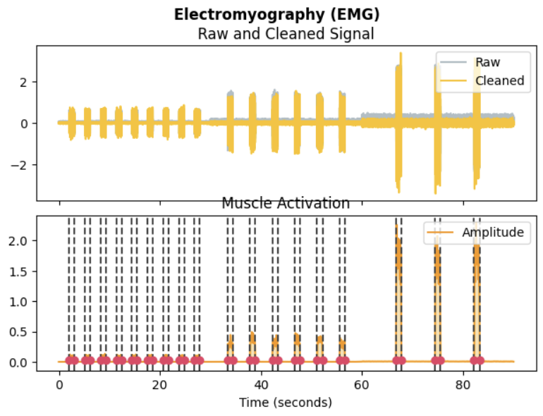
```
# Limpieza manual de la señal
emg_clean = nk.emg_clean(emg_total, sampling_rate=sampling_rate)

# Extracción de la envolvente (amplitud)
emg_amplitude = nk.emg_amplitude(emg_clean)

# Visualización: señal limpia y su envolvente
plt.figure(figsize=(12, 4))
plt.plot(emg_clean, label='EMG Limpia', alpha=0.6)
plt.plot(emg_amplitude, label='Envolvente (Amplitud)', color='orange', linewidth=2)
plt.title("Señal EMG Limpia y su Envolvente")
plt.xlabel("Muestras")
plt.ylabel("Amplitud")
plt.legend()
plt.grid(True)
plt.tight_layout()
plt.show()
```
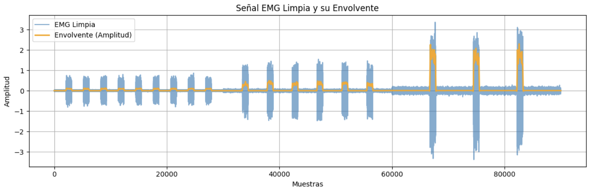
```
ventana_duracion = 1  # segundos
ventana_muestras = ventana_duracion * sampling_rate
n_ventanas = len(emg_amplitude) // ventana_muestras

# Listas para almacenar métricas por ventana
rms_por_ventana = []
fmed_por_ventana = []

# Iterar por cada ventana de 1s
for i in range(n_ventanas):
    inicio = i * ventana_muestras
    fin = inicio + ventana_muestras
    ventana = emg_amplitude[inicio:fin]

    # RMS de la envolvente (media directa, ya que es positiva)
    rms = np.mean(ventana)
    rms_por_ventana.append(rms)


for i in range(n_ventanas):
    inicio = i * ventana_muestras
    fin = inicio + ventana_muestras
    ventana = emg_clean[inicio:fin]

    # Frecuencia mediana con Welch
    f, Pxx = welch(ventana, fs=sampling_rate, nperseg=256)
    cumsum = np.cumsum(Pxx)
    total_power = cumsum[-1]
    f_mediana = f[np.where(cumsum >= total_power / 2)[0][0]]
    fmed_por_ventana.append(f_mediana)

# Crear eje temporal en segundos
tiempo_ventanas = np.arange(1, n_ventanas + 1)

# Graficar métricas
plt.figure(figsize=(12, 4))

plt.subplot(1, 2, 1)
plt.plot(tiempo_ventanas, rms_por_ventana, marker='o', label='RMS')
plt.title("RMS de la Envolvente por ventana de 1s")
plt.xlabel("Tiempo (s)")
plt.ylabel("RMS")
plt.grid(True)

plt.subplot(1, 2, 2)
plt.plot(tiempo_ventanas, fmed_por_ventana, marker='o', color='orange', label='F. Mediana')
plt.title("Frecuencia Mediana por ventana de 1s")
plt.xlabel("Tiempo (s)")
plt.ylabel("Frecuencia (Hz)")
plt.grid(True)

plt.tight_layout()
plt.show()

plt.tight_layout()
plt.show()
```
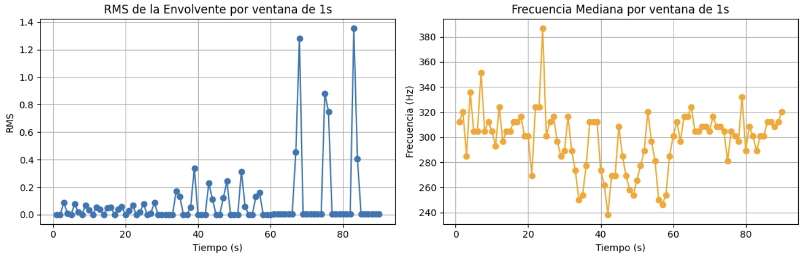
```
# Ajuste lineal RMS vs tiempo
slope_rms, intercept_rms, r_rms, _, _ = linregress(tiempo_ventanas, rms_por_ventana)

# Ajuste lineal Frecuencia Mediana vs tiempo
slope_fmed, intercept_fmed, r_fmed, _, _ = linregress(tiempo_ventanas, fmed_por_ventana)

# Graficar con líneas ajustadas y mostrar pendiente en el título
plt.figure(figsize=(12, 5))

# RMS
plt.subplot(1, 2, 1)
plt.plot(tiempo_ventanas, rms_por_ventana, 'o', label='RMS por ventana')
plt.plot(tiempo_ventanas, intercept_rms + slope_rms * tiempo_ventanas, 'r-', label='Ajuste lineal')
plt.title(f"RMS vs Tiempo\nPendiente = {slope_rms:.4f}")
plt.xlabel("Tiempo (s)")
plt.ylabel("RMS")
plt.legend()
plt.grid(True)

# Frecuencia Mediana
plt.subplot(1, 2, 2)
plt.plot(tiempo_ventanas, fmed_por_ventana, 'o', color='orange', label='F. Mediana por ventana')
plt.plot(tiempo_ventanas, intercept_fmed + slope_fmed * tiempo_ventanas, 'r-', label='Ajuste lineal')
plt.title(f"Frecuencia Mediana vs Tiempo\nPendiente = {slope_fmed:.4f} Hz/s")
plt.xlabel("Tiempo (s)")
plt.ylabel("Frecuencia (Hz)")
plt.legend()
plt.grid(True)

plt.tight_layout()
plt.show()
```
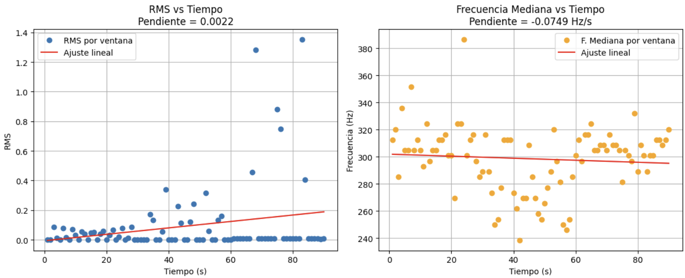

Respondiendo las preguntas:
- ¿Cuál de las dos pendientes (RMS o freq_med) resulta ser un indicador más sensible a la fatiga en este escenario sintético? ¿Cómo cambiarían las pendientes si aumentas el nivel de ruido en la simulación?

Aunque la pendiente sea menor y por ende uno puede pensar que termina siendo menos sensible, la pendiente que resulta ser un indicador más sensible a la fatiga es la de la gráfica de RMS vs tiempo y es debido a que sus puntos tienen más relación con las variaciones generadas que el de la curva de la frecuencia mediana. Ambas curvas muestran variaciones esperadas, aumentando la potencia frente a más gátiga en la primera, y disminuyendo la frecuencia al usar fibras más lentas en la gráfica de la frecuencia media. Sin embargo, la segunda gráfica uestra mayores variaciones en la segunda etapa de la señal en vez de la tercera, que teóricamente debería ser la parte con mayor variación negativa al tener una mayor fátiga. Por ende, aun cuando en este corto periodo puede mostrar mejores resultados la segunda gráfica, es la primera que muestra más congruencia y sensibilidad frente a los cambios de la señal

- ¿Cómo cambiarían las pendientes si aumentas el nivel de ruido en la simulación?

Al aumentar el nivel de ruido en la simulación de la señal EMG, la pendiente del RMS tiende a incrementarse debido a que el ruido eleva artificialmente la amplitud de la señal, generando valores más altos por ventana incluso sin un cambio real en la activación muscular. Por otro lado, la pendiente de la frecuencia mediana puede alterarse dependiendo del contenido espectral del ruido: si incluye componentes de alta frecuencia, puede aumentar la frecuencia mediana y aplanar o revertir la pendiente, reduciendo su sensibilidad para detectar fatiga. En conjunto, el ruido distorsiona ambas métricas y compromete la interpretación fisiológica del análisis.
