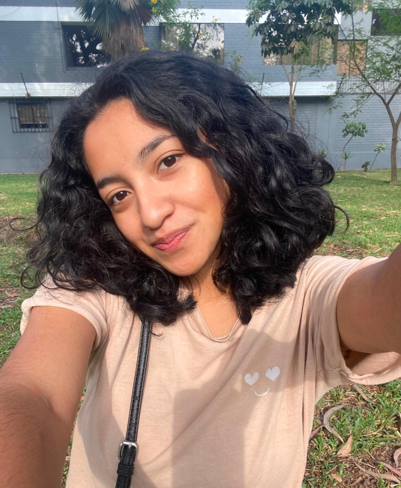
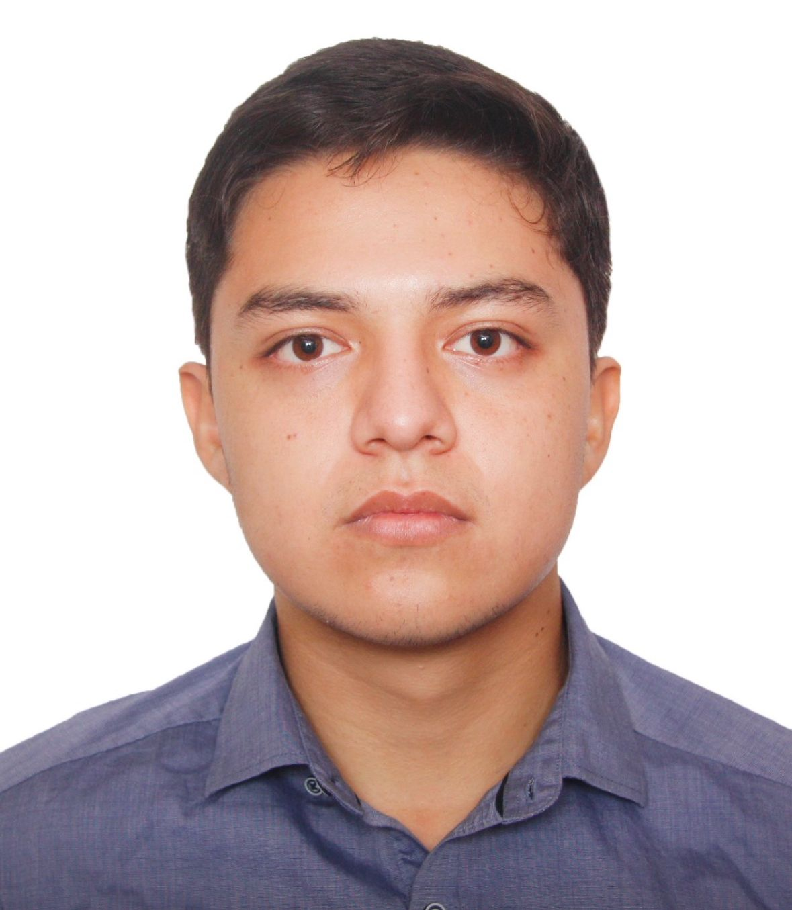

# GRUPO2-ISB-2025-I

## Introducción
¡Bienvenidos! Este repositorio contiene los materiales, códigos y documentación del Grupo 2 para nuestro proyecto y laboratorios en el curso de Introducción a Señales Biomédicas 2025-I. Aquí registraremos nuestros avances y análisis, con el objetivo de explorar, aprender y aplicar conceptos en señales biomédicas mediante un enfoque práctico y colaborativo.

## ¿Quiénes somos?
| Foto | Presentación | 
|----------|----------|
|      | **Christian Andre Ayala Pichilingue**  *christian.ayala@upch.pe*  Hola, soy Christian y estoy interesado en la biomecánica y la rehabilitación estoy trabajando como asistente de investigación en el Laboratorio de Ingeniería Biomecánica y Robótica Aplicada(LIBRA) en la PUCP.  |
|      | **Anny Esmeralda Correa Díaz**  *anny.correa@upch.pe*  ¡Hola! Soy Anny Correa, estudiante de la carrera de Ingeniería Biomédica. Me apasiona el desarrollo de tecnologías en salud enfocadas al área de Ingeniería Clínica y las aplicaciones potenciales de la rama de Ingeniería de Tejidos y Biomateriales.  |
|      | **Alex Ricardo Sánchez Valenzuela**  *alex.sanchez.v@upch.pe*  Hola, soy Alex Sánchez, estudiante de Ingeniería Biomédica. Me apasiona la investigación, especialmente en el área de biomateriales e ingeniería de tejidos. Estoy interesado en explorar cómo estas disciplinas pueden contribuir al desarrollo de soluciones innovadoras en el ámbito de la salud, mejorando la calidad de vida de los pacientes mediante avances tecnológicos. |

## Docentes del curso
- **Moises Stevend Meza Rodriguez** - moises.meza@upch.pe
- **Jose Alonso Cáceres del Aguila** - jose.caceres.d@upch.pe
- **Umbert Lewis De la Cruz Rodriguez** - umbert.de.la.cruz@upch.pe
